# System Architecture

## Overview

Sentinel Log AI is a polyglot log intelligence system that combines Go's performance for log ingestion with Python's ML/AI ecosystem for intelligent analysis.

## High-Level Architecture

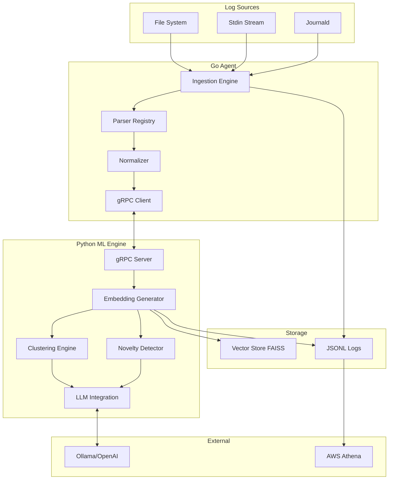

## Component Architecture

### Go Agent Components

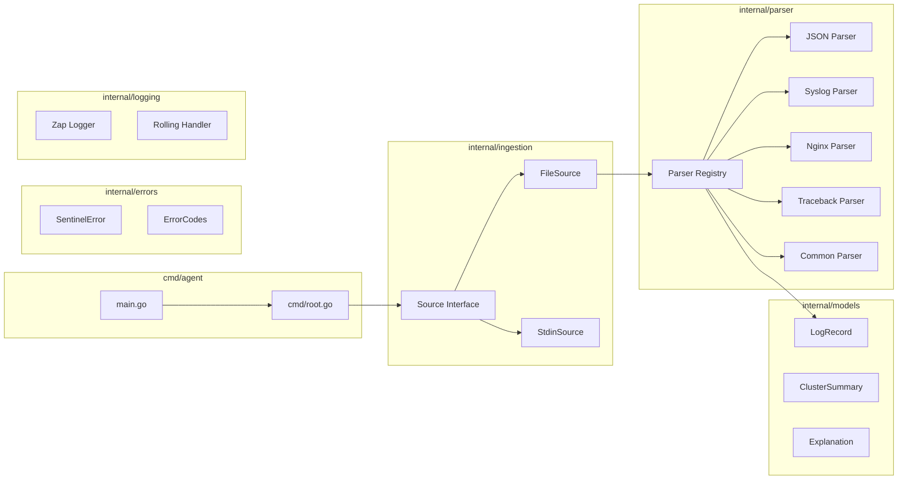

### Python ML Engine Components

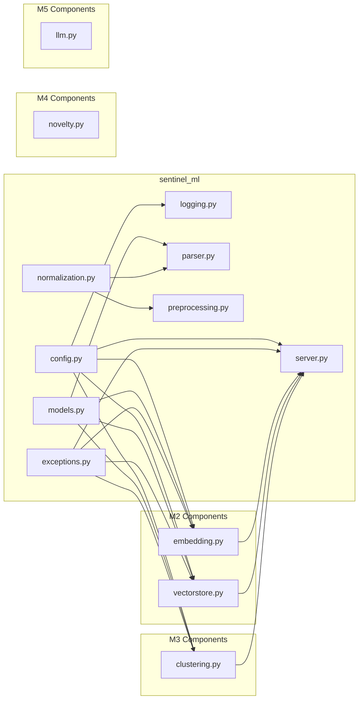

## Embedding Architecture (M2)

The embedding subsystem provides semantic vector representations of log messages:

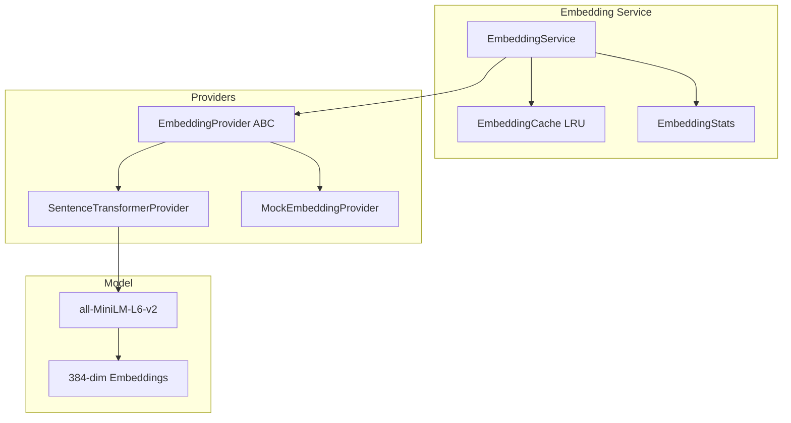

### Embedding Provider Strategy Pattern

The embedding system uses the Strategy pattern for provider flexibility:

| Provider | Use Case |
|----------|----------|
| `SentenceTransformerProvider` | Production - Uses sentence-transformers models |
| `MockEmbeddingProvider` | Testing - Deterministic mock embeddings |

### Embedding Cache Architecture

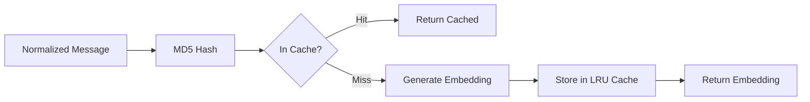

## Vector Store Architecture (M2)

The vector store provides high-performance similarity search:

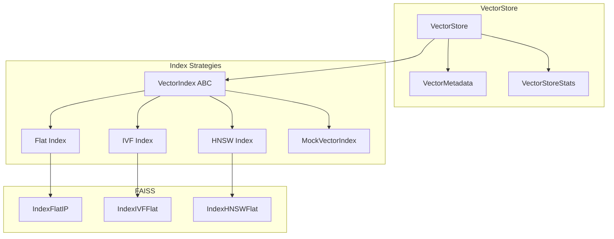

### Index Strategy Selection

| Strategy | Best For | Trade-offs |
|----------|----------|------------|
| `Flat` | Small datasets (<10K) | Exact search, slower at scale |
| `IVF` | Medium datasets (10K-1M) | Fast approximate, requires training |
| `HNSW` | Large datasets (1M+) | Very fast, higher memory |

### Persistence Model

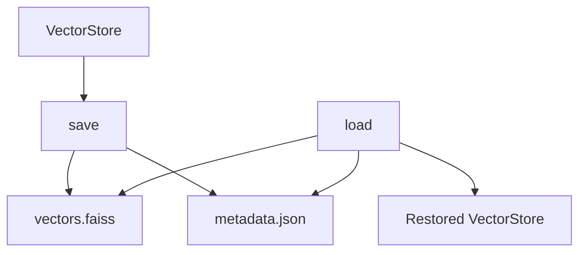

## Clustering Architecture (M3)

The clustering subsystem discovers patterns in log data using HDBSCAN:

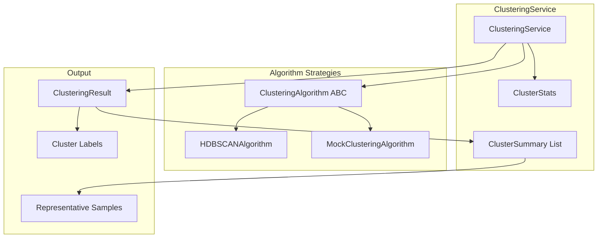

### Clustering Algorithm Strategy Pattern

The clustering system uses the Strategy pattern for algorithm flexibility:

| Algorithm | Use Case |
|-----------|----------|
| `HDBSCANAlgorithm` | Production - Density-based clustering, handles noise |
| `MockClusteringAlgorithm` | Testing - Deterministic mock clustering |

### HDBSCAN Configuration

| Parameter | Default | Description |
|-----------|---------|-------------|
| `min_cluster_size` | 5 | Minimum cluster size |
| `min_samples` | 3 | Core point threshold |
| `cluster_selection_epsilon` | 0.0 | Merge clusters within epsilon |
| `metric` | euclidean | Distance metric |

### Cluster Summary Generation

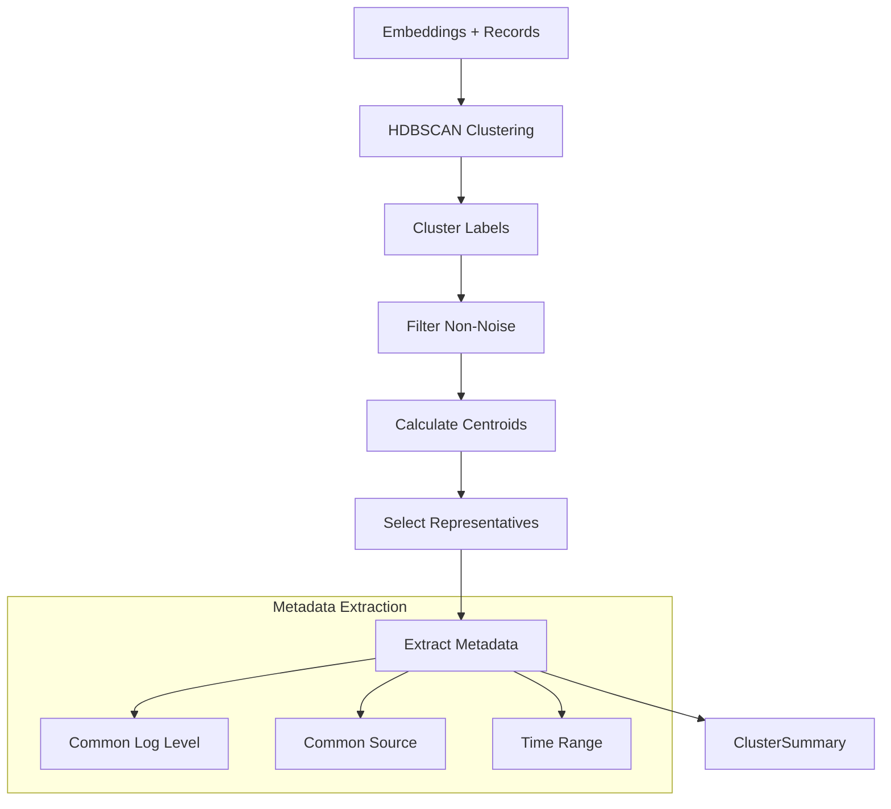

### Representative Selection Algorithm

1. Calculate cluster centroid from member embeddings
2. Compute distance from each member to centroid
3. Select N closest members as representatives
4. Extract their messages for summary

## Novelty Detection Architecture (M4)

The novelty detection subsystem identifies unusual log patterns using k-NN density estimation:

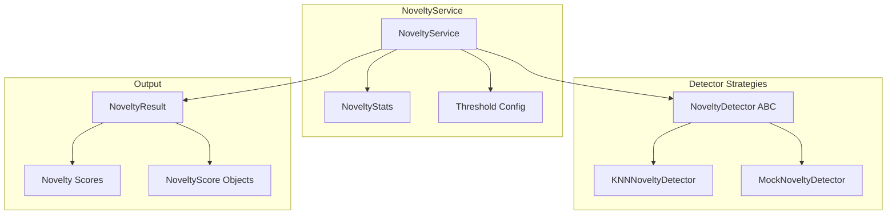

### Novelty Detector Strategy Pattern

The novelty system uses the Strategy pattern for algorithm flexibility:

| Algorithm | Use Case |
|-----------|----------|
| `KNNNoveltyDetector` | Production - k-NN density-based novelty scoring |
| `MockNoveltyDetector` | Testing - Deterministic mock scores |

### k-NN Novelty Configuration

| Parameter | Default | Description |
|-----------|---------|-------------|
| `threshold` | 0.7 | Score threshold for novel classification |
| `k_neighbors` | 5 | Number of neighbors for density estimation |
| `use_density` | true | Use density-based vs distance-based scoring |

### Novelty Detection Algorithm

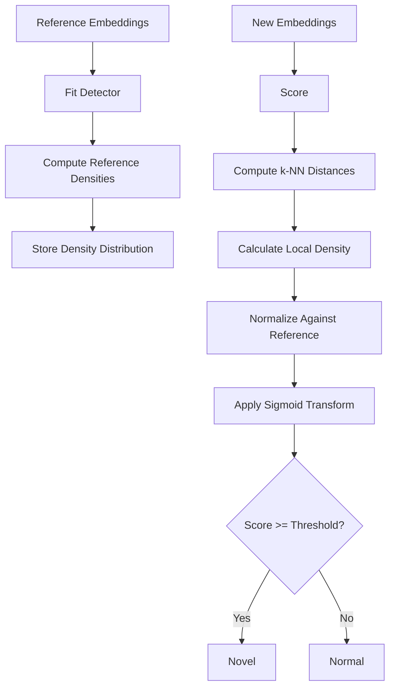

### k-NN Density Scoring

1. **Fit Phase**: Compute k-NN distances for reference embeddings
2. **Reference Distribution**: Calculate mean and std of densities
3. **Score Phase**: For new samples, compute k-NN distances to reference
4. **Density Estimation**: density = 1 / (mean k-NN distance + ε)
5. **Normalization**: z-score against reference distribution
6. **Transform**: Sigmoid to map to [0, 1] novelty score

### Novelty Score Interpretation

| Score Range | Interpretation |
|-------------|----------------|
| 0.0 - 0.3 | Normal - High density, close to known patterns |
| 0.3 - 0.5 | Slightly unusual - Moderate deviation |
| 0.5 - 0.7 | Unusual - Notable deviation from patterns |
| 0.7 - 0.9 | Novel - Significant anomaly |
| 0.9 - 1.0 | Highly novel - Extreme outlier |

## LLM Explanation Architecture (M5)

The LLM subsystem provides human-readable explanations for log patterns using large language models:

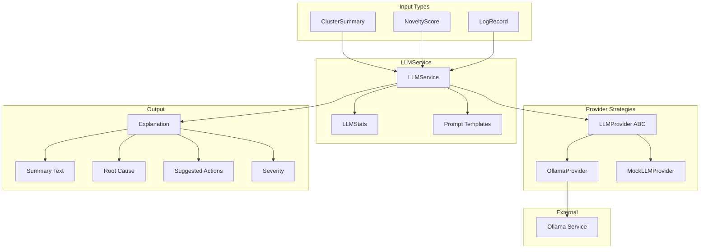

### LLM Provider Strategy Pattern

The LLM system uses the Strategy pattern for provider flexibility:

| Provider | Use Case |
|----------|----------|
| `OllamaProvider` | Production - Ollama REST API with retry logic |
| `MockLLMProvider` | Testing - Deterministic mock responses |

### LLM Configuration

| Parameter | Default | Description |
|-----------|---------|-------------|
| `provider` | ollama | LLM provider type |
| `model` | llama3.2 | Model name to use |
| `base_url` | http://localhost:11434 | Ollama server URL |
| `timeout` | 120 | Request timeout in seconds |
| `max_retries` | 3 | Maximum retry attempts |
| `temperature` | 0.1 | Response temperature (lower = more focused) |

### Explanation Types

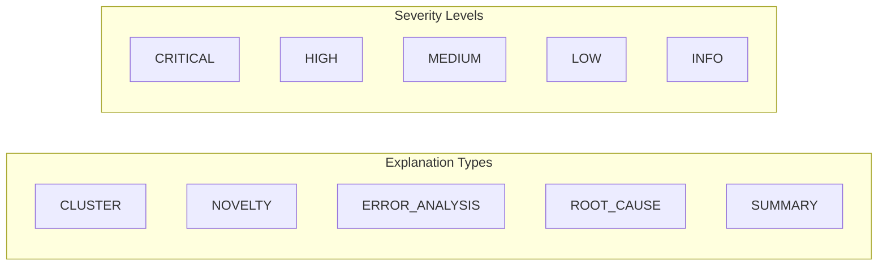

| Explanation Type | Input | Purpose |
|------------------|-------|---------|
| `CLUSTER` | ClusterSummary | Explain cluster pattern and root cause |
| `NOVELTY` | NoveltyScore | Explain why pattern is novel |
| `ERROR_ANALYSIS` | LogRecord | Analyze error and suggest fixes |
| `ROOT_CAUSE` | Multiple inputs | Deep root cause analysis |
| `SUMMARY` | Aggregated data | Executive summary of analysis |

### LLM Explanation Flow

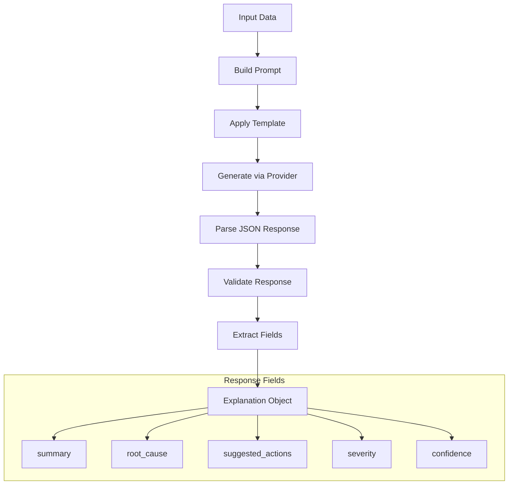

### Prompt Templates

Four specialized prompt templates optimize LLM responses:

| Template | Purpose | Key Fields |
|----------|---------|------------|
| `CLUSTER_EXPLANATION_PROMPT` | Cluster analysis | log_messages, cluster_size, common_level |
| `NOVELTY_EXPLANATION_PROMPT` | Novel pattern explanation | log_message, novelty_score, threshold |
| `ERROR_ANALYSIS_PROMPT` | Error diagnosis | error_message, log_level, source, context |
| `SUMMARY_PROMPT` | Executive summary | total_logs, n_clusters, n_novel |

### Retry Logic with Exponential Backoff

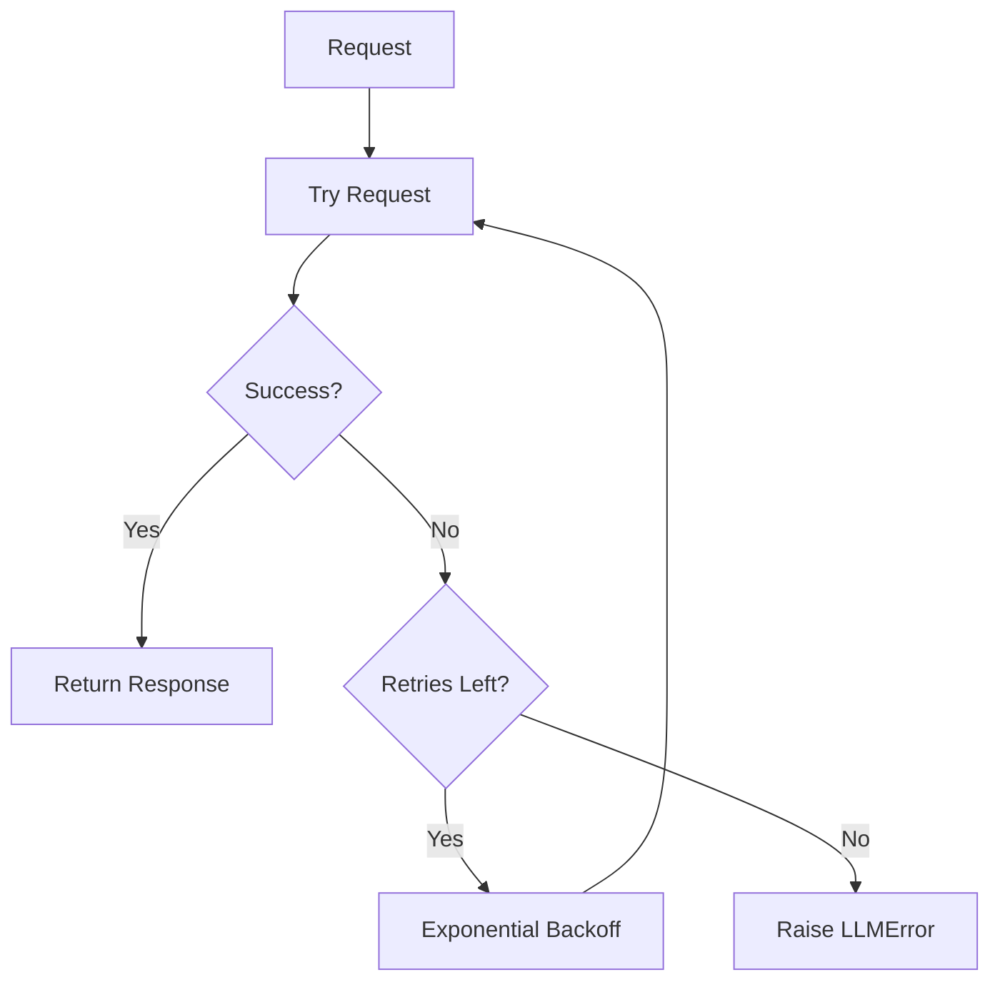

Backoff formula: `delay = 2^attempt` seconds

### Response Parsing

The LLMService handles various LLM response formats:

1. **Pure JSON**: Directly parsed
2. **Markdown Code Block**: Extracts JSON from ```json``` blocks
3. **Invalid JSON**: Raises `LLMError.invalid_response()`

### LLM Error Handling

| Error Type | Error Code | Retryable |
|------------|------------|-----------|
| `LLM_PROVIDER_ERROR` | 6000 | Yes |
| `LLM_RATE_LIMITED` | 6001 | Yes |
| `LLM_CONTEXT_TOO_LONG` | 6002 | No |
| `LLM_INVALID_RESPONSE` | 6003 | Yes |

## CLI & UX Architecture (M6)

The CLI subsystem provides a rich, themeable command-line interface for interacting with the log analysis system:

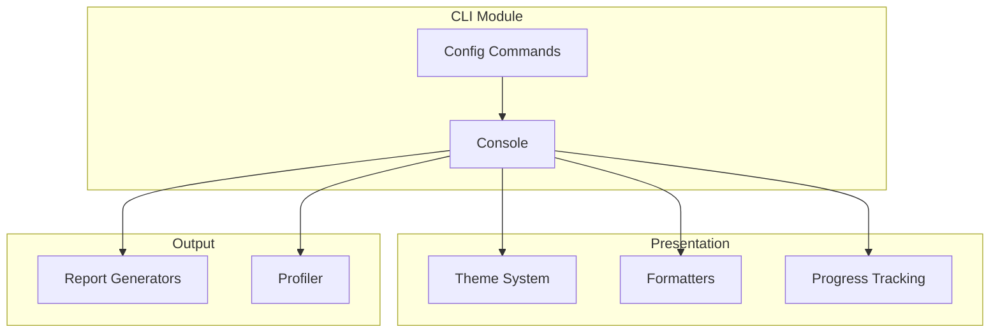

### Design Patterns

The CLI module implements several design patterns:

| Pattern | Component | Purpose |
|---------|-----------|---------|
| **Strategy** | `Theme`, `Formatter` | Interchangeable themes and output formats |
| **Facade** | `Console` | Unified interface for all CLI operations |
| **Template Method** | `Reporter` | Base report structure with customizable sections |
| **Decorator** | `Profiler` | Add timing instrumentation to functions |
| **Observer** | `ProgressTracker` | Track and display progress updates |

### Theme System

The theme system provides accessibility-aware color schemes:

| Theme | Use Case |
|-------|----------|
| `DARK` | Default, for dark terminals |
| `LIGHT` | For light terminal backgrounds |
| `MINIMAL` | Reduced color palette |
| `COLORBLIND` | Deuteranopia/protanopia friendly |
| `NONE` | No colors, plain text |

### Formatter Architecture

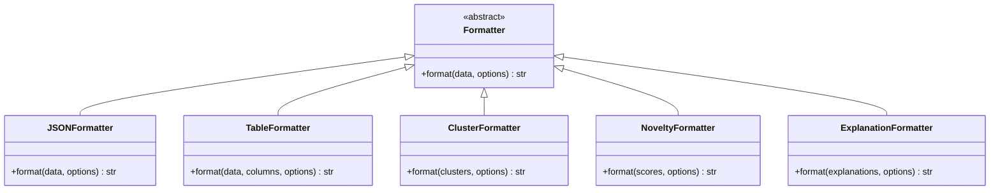

### Console Features

The Console class provides:

1. **Themed Output**: Semantic colors for info, success, warning, error
2. **Multiple Formats**: TEXT, JSON, TABLE, COMPACT
3. **Progress Tracking**: Spinners, progress bars, ETA calculation
4. **Output Capture**: Capture output for testing
5. **User Prompts**: Interactive input with defaults

### Report Generation

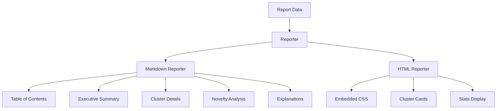

### Profiler Integration

The profiler provides detailed timing breakdown:

```python
from sentinel_ml.cli import measure, profile

@profile("analyze_logs")
def analyze(logs):
    with measure("embedding"):
        embeddings = embed(logs)
    with measure("clustering"):
        clusters = cluster(embeddings)
    return clusters
```

Output:
```
Performance Profile
──────────────────────────────
analyze_logs          150.32ms (100.0%)
├── embedding          89.45ms  (59.5%)
└── clustering         60.12ms  (40.0%)
```

### Configuration Management

| Command | Description |
|---------|-------------|
| `generate_config()` | Create default config file |
| `validate_config()` | Validate existing config |
| `load_config()` | Parse and instantiate Config |
| `show_config()` | Display current config |

## Layer Architecture

The system follows a layered architecture pattern:

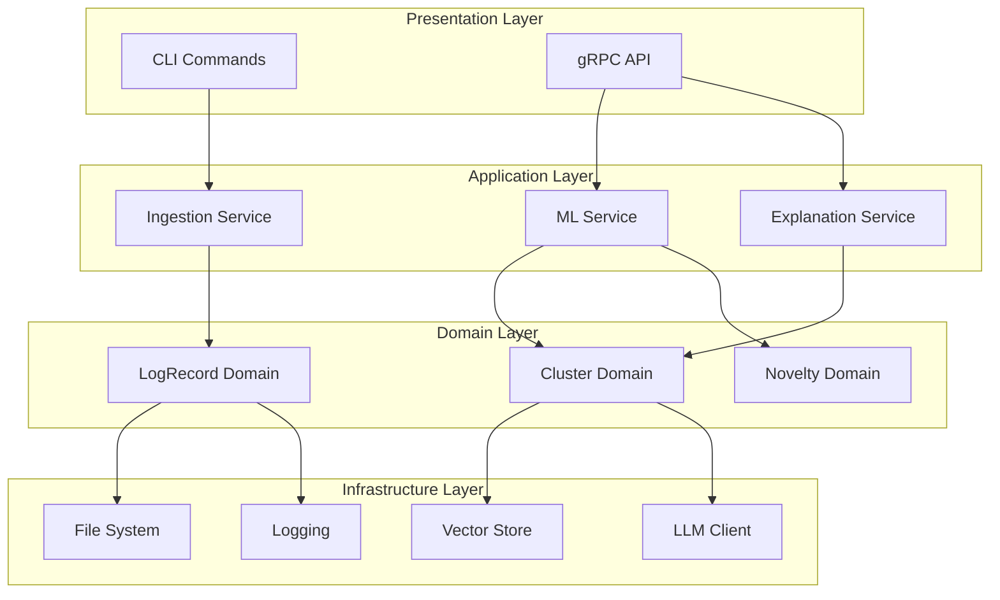

## SOLID Design Principles

### Single Responsibility Principle (SRP)

Each module has one clear responsibility:

| Module | Responsibility |
|--------|---------------|
| `parser.go` | Parse log lines into structured records |
| `source.go` | Read logs from various sources |
| `logging.go` | Structured JSONL logging |
| `errors.go` | Error types and handling |
| `normalization.py` | Mask sensitive data in logs |
| `exceptions.py` | Exception hierarchy |

### Open/Closed Principle (OCP)

- Parser Registry allows adding new parsers without modifying existing code
- Source interface enables new ingestion sources
- Normalization pipeline supports custom rules

### Liskov Substitution Principle (LSP)

- All parsers implement the Parser interface
- All sources implement the Source interface
- All exceptions inherit from SentinelError

### Interface Segregation Principle (ISP)

- Small, focused interfaces (Parser, Source)
- No forced implementation of unused methods

### Dependency Inversion Principle (DIP)

- Components depend on abstractions (interfaces)
- Logging, parsing, and sources are injected

## Concurrency Model

### Go Agent

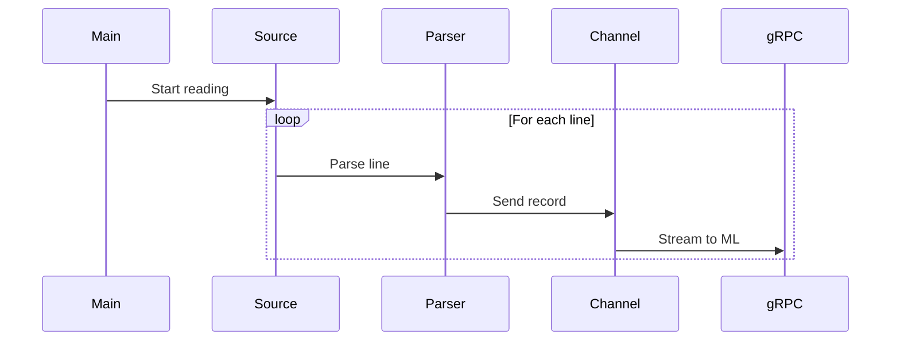

### Python ML Engine

```mermaid
sequenceDiagram
    participant gRPC
    participant ThreadPool
    participant Embedding
    participant VectorStore
    participant Clustering

    gRPC->>ThreadPool: Receive batch
    ThreadPool->>Embedding: Generate embeddings
    Embedding->>VectorStore: Store vectors
    VectorStore->>Clustering: Update clusters
    Clustering->>gRPC: Return results
```

## Deployment Architecture

```mermaid
graph TB
    subgraph "Single Host"
        AGENT[Go Agent]
        ML[Python ML Engine]
        OLLAMA_L[Ollama Local]
    end

    subgraph "Distributed"
        AGENT_D[Go Agent Pods]
        ML_D[ML Engine Pods]
        OLLAMA_D[Ollama Service]
        VS_D[Vector Store Service]
    end

    subgraph "Cloud"
        AGENT_C[Agent Container]
        ML_C[ML Container]
        OPENAI[OpenAI API]
        COSMOS[Azure Cosmos DB]
        ATHENA[AWS Athena]
    end
```

## Technology Stack

| Layer | Technology | Purpose |
|-------|-----------|---------|
| Agent | Go 1.22 | High-performance log ingestion |
| CLI | Cobra | Command-line interface |
| Logging | Zap + Lumberjack | JSONL rolling logs |
| ML Engine | Python 3.10+ | ML/AI processing |
| Config | Pydantic | Configuration management |
| Logging | Structlog | Structured logging |
| IPC | gRPC + Protobuf | Agent-ML communication |
| Vector Store | FAISS | Embedding storage and search |
| Clustering | HDBSCAN | Log pattern clustering |
| LLM | Ollama/OpenAI | Log explanation generation |

## Benchmark Framework

The benchmark framework provides tools for performance testing, memory profiling, and scale testing.

### Benchmark Architecture

```mermaid
graph TB
    subgraph "Benchmark Module"
        RUNNER[BenchmarkRunner]
        SUITE[BenchmarkSuite]
        FUNC[FunctionBenchmark]
    end

    subgraph "Metrics Collection"
        TIMING[TimingMetrics]
        THROUGHPUT[ThroughputMetrics]
        MEMORY[MemoryTracker]
        COLLECTOR[MetricsCollector]
    end

    subgraph "Memory Profiling"
        PROFILER[MemoryProfiler]
        SNAPSHOT[MemorySnapshot]
    end

    subgraph "Dataset Generation"
        DATASET_GEN[DatasetGenerator]
        DATASET_CFG[DatasetConfig]
    end

    SUITE --> RUNNER
    FUNC --> RUNNER
    RUNNER --> COLLECTOR
    COLLECTOR --> TIMING
    COLLECTOR --> THROUGHPUT
    COLLECTOR --> MEMORY
    RUNNER --> PROFILER
    PROFILER --> SNAPSHOT
    RUNNER --> DATASET_GEN
    DATASET_GEN --> DATASET_CFG
```

### Benchmark Execution Flow

```mermaid
sequenceDiagram
    participant Suite as BenchmarkSuite
    participant Runner as BenchmarkRunner
    participant Metrics as MetricsCollector
    participant Profiler as MemoryProfiler

    Suite->>Runner: execute()
    Runner->>Runner: setup()
    Runner->>Profiler: set_baseline()
    
    loop Warmup Iterations
        Runner->>Runner: run_iteration()
    end

    loop Measured Iterations
        Runner->>Metrics: time_operation()
        Runner->>Runner: run_iteration()
        Runner->>Profiler: snapshot()
    end

    Runner->>Runner: teardown()
    Runner->>Metrics: collect_metrics()
    Runner-->>Suite: BenchmarkResult
```

### Dataset Scale Testing

```mermaid
graph LR
    subgraph "Scale Configurations"
        SMALL[Small: 1K logs]
        MEDIUM[Medium: 10K logs]
        LARGE[Large: 100K logs]
        XLARGE[XLarge: 1M logs]
    end

    subgraph "Log Patterns"
        HTTP[HTTP Request]
        DB[Database Query]
        AUTH[Auth Event]
        ERROR[Error Stack]
        METRIC[Metric Log]
    end

    SMALL --> HTTP
    MEDIUM --> DB
    LARGE --> AUTH
    XLARGE --> ERROR
```

### Memory Profiling

| Component | Purpose |
|-----------|---------|
| `MemoryProfiler` | Track memory usage over time |
| `MemorySnapshot` | Point-in-time memory measurement |
| `MemoryTracker` | Observer pattern for memory changes |
| `profile_memory` | Context manager for profiling |
| `memory_profile` | Decorator for function profiling |

### Metrics Collection

| Metric Type | Collected Data |
|-------------|----------------|
| `TimingMetrics` | mean, median, p50, p95, p99, std_dev |
| `ThroughputMetrics` | items/sec, MB/sec, total bytes |
| `MemoryTracker` | RSS, VMS, peak, growth, GC stats |

## Storage and Retention Architecture

The storage module provides data lifecycle management including retention policies, snapshots, and import/export.

### Storage Module Architecture

```mermaid
graph TB
    subgraph "Retention Engine"
        POLICY[RetentionPolicy]
        AGE[AgeCriteria]
        SIZE[SizeCriteria]
        COMP[CompositeCriteria]
    end

    subgraph "Snapshot Management"
        SNAP_MGR[SnapshotManager]
        SNAP[Snapshot]
        SNAP_META[SnapshotMetadata]
    end

    subgraph "Import/Export"
        EXPORTER[BundleExporter]
        IMPORTER[BundleImporter]
        MANIFEST[BundleManifest]
    end

    subgraph "Versioning"
        VER_MGR[VersionManager]
        MIGRATION[Migration]
        REGISTRY[MigrationRegistry]
    end

    POLICY --> AGE
    POLICY --> SIZE
    POLICY --> COMP
    SNAP_MGR --> SNAP
    SNAP --> SNAP_META
    EXPORTER --> MANIFEST
    IMPORTER --> MANIFEST
    VER_MGR --> MIGRATION
    VER_MGR --> REGISTRY
```

### Retention Policy Flow

```mermaid
sequenceDiagram
    participant User
    participant Policy as RetentionPolicy
    participant Criteria as RetentionCriteria
    participant Observer as RetentionObserver
    participant FS as FileSystem

    User->>Policy: apply(directory)
    Policy->>Observer: notify(STARTED)
    Policy->>FS: scan files
    
    loop For each file
        Policy->>Criteria: should_delete(file)
        alt Delete
            Policy->>FS: unlink(file)
            Policy->>Observer: notify(FILE_DELETED)
        end
    end

    Policy->>Observer: notify(COMPLETED)
    Policy-->>User: RetentionResult
```

### Snapshot Lifecycle

```mermaid
stateDiagram-v2
    [*] --> Creating
    Creating --> Completed: success
    Creating --> Failed: error
    Completed --> Deleted: delete()
    Failed --> [*]
    Deleted --> [*]
    
    Completed --> Restoring: restore()
    Restoring --> Completed: success
```

### Import/Export Bundle Structure

```
bundle.tar.gz
    bundle_metadata.json     # Bundle metadata
    bundle_manifest.json     # File checksums
    vectors/                  # Vector index files
        index.faiss
        metadata.json
    config/                   # Configuration
        sentinel-ml.yaml
    data/                     # Additional data
        clusters.json
```

### Version Migration Flow

```mermaid
flowchart TD
    START[Check Version] --> COMPARE{Current == Target?}
    COMPARE -->|Yes| DONE[No Migration Needed]
    COMPARE -->|No| FIND[Find Migration Path]
    FIND --> PATH{Path Found?}
    PATH -->|No| ERROR[No Path Available]
    PATH -->|Yes| APPLY[Apply Migrations]
    APPLY --> UPDATE[Update Version File]
    UPDATE --> DONE
```

### Retention Policies

| Policy Type | Criteria | Use Case |
|-------------|----------|----------|
| `AgeCriteria` | Files older than N days | Remove old logs |
| `SizeCriteria` | Directory exceeds N MB | Disk space management |
| `CompositeCriteria` | AND/OR combination | Complex policies |

### Snapshot Configuration

| Setting | Default | Description |
|---------|---------|-------------|
| `max_snapshots` | 10 | Maximum retained snapshots |
| `compression_level` | 6 | Gzip compression (1-9) |
| `auto_cleanup` | true | Auto-delete old snapshots |

### Schema Versioning

Follows semantic versioning (MAJOR.MINOR.PATCH):
- **MAJOR**: Breaking changes requiring migration
- **MINOR**: Backward-compatible additions
- **PATCH**: Backward-compatible fixes

Compatibility rule: Same MAJOR version = compatible.

## Alerting and Integrations

### Alerting Module Overview

The alerting module provides a flexible notification framework for delivering alerts when novel log events are detected.

```mermaid
graph TB
    subgraph "Detection Layer"
        WD[Watch Daemon]
        ML[ML Pipeline]
    end

    subgraph "Routing Layer"
        AR[Alert Router]
        RR1[Routing Rule 1]
        RR2[Routing Rule 2]
        RRN[Routing Rule N]
    end

    subgraph "Notification Layer"
        SN[Slack Notifier]
        EN[Email Notifier]
        WN[Webhook Notifier]
        GH[GitHub Issue Creator]
    end

    subgraph "Monitoring Layer"
        HC[Health Check]
        HTTP[HTTP Server]
    end

    WD --> ML
    ML --> AR
    AR --> RR1
    AR --> RR2
    AR --> RRN
    
    RR1 --> SN
    RR2 --> EN
    RRN --> WN
    RRN --> GH
    
    WD --> HC
    SN --> HC
    EN --> HC
    WN --> HC
    GH --> HC
    
    HC --> HTTP
```

### Notifier Class Hierarchy

```mermaid
classDiagram
    class BaseNotifier {
        <<abstract>>
        +name: str
        +send(event: AlertEvent) AlertResult
        +send_batch(events: List) List
        +validate_config() List
        +health_check() bool
        #_send_impl(event)* AlertResult
    }

    class NotifierConfig {
        +name: str
        +enabled: bool
        +max_retries: int
        +retry_delay_seconds: float
        +timeout_seconds: float
    }

    class AlertEvent {
        +event_id: str
        +message: str
        +priority: AlertPriority
        +source: str
        +timestamp: datetime
        +tags: List
        +metadata: Dict
        +novelty_score: float
    }

    class AlertResult {
        +event_id: str
        +notifier_name: str
        +status: AlertStatus
        +message: str
        +timestamp: datetime
        +response_data: Dict
    }

    class SlackNotifier {
        +webhook_url: str
        +channel: str
        #_send_impl(event) AlertResult
        -_build_payload(event) Dict
    }

    class EmailNotifier {
        +smtp_host: str
        +smtp_port: int
        +from_address: str
        +to_addresses: List
        #_send_impl(event) AlertResult
        -_build_message(event) MIMEMultipart
    }

    class WebhookNotifier {
        +url: str
        +method: str
        +auth_type: str
        #_send_impl(event) AlertResult
        -_build_headers() Dict
    }

    class GitHubIssueCreator {
        +owner: str
        +repo: str
        +token: str
        #_send_impl(event) AlertResult
        -_build_issue_body(event) str
    }

    BaseNotifier <|-- SlackNotifier
    BaseNotifier <|-- EmailNotifier
    BaseNotifier <|-- WebhookNotifier
    BaseNotifier <|-- GitHubIssueCreator
    BaseNotifier --> NotifierConfig
    BaseNotifier --> AlertEvent
    BaseNotifier --> AlertResult
```

### Watch Daemon State Machine

```mermaid
stateDiagram-v2
    [*] --> STOPPED
    STOPPED --> STARTING: start()
    STARTING --> RUNNING: init complete
    STARTING --> ERROR: init failed
    RUNNING --> STOPPING: stop()
    RUNNING --> ERROR: critical failure
    STOPPING --> STOPPED: cleanup complete
    ERROR --> STOPPED: reset()
    ERROR --> STARTING: restart()
```

### Alert Routing Flow

```mermaid
sequenceDiagram
    participant WD as Watch Daemon
    participant AR as Alert Router
    participant RR as Routing Rules
    participant NT as Notifiers
    participant HC as Health Check

    WD->>WD: Poll log files
    WD->>WD: Detect novel lines
    WD->>AR: Create AlertEvent

    AR->>RR: Evaluate rules
    loop For each rule
        RR->>RR: Check priority filter
        RR->>RR: Check tags filter
        RR->>RR: Check source pattern
        alt Rule matches
            RR->>NT: Get target notifiers
            NT->>NT: send(event)
            NT-->>AR: AlertResult
            alt stop_on_match
                RR-->>AR: Stop evaluation
            end
        end
    end

    alt No matches
        AR->>NT: Send to fallback notifiers
    end

    HC->>WD: Check daemon status
    HC->>NT: Check notifier health
    HC-->>HC: Aggregate health status
```

### Notifier Configuration

| Notifier | Required Config | Optional Config |
|----------|-----------------|-----------------|
| `SlackNotifier` | `webhook_url` | `channel`, `username`, `icon_emoji`, `mention_users`, `mention_groups` |
| `EmailNotifier` | `smtp_host`, `from_address`, `to_addresses` | `smtp_port`, `use_ssl`, `use_tls`, `cc_addresses` |
| `WebhookNotifier` | `url` | `method`, `auth_type`, `auth_token`, `payload_template` |
| `GitHubIssueCreator` | `owner`, `repo`, `token` | `labels`, `assignees`, `deduplicate` |

### Priority Mapping

| Priority | Score Range | Color (Slack) | X-Priority (Email) |
|----------|-------------|---------------|-------------------|
| `CRITICAL` | >= 0.9 | #dc3545 (red) | 1 |
| `HIGH` | >= 0.7 | #fd7e14 (orange) | 2 |
| `MEDIUM` | >= 0.5 | #ffc107 (yellow) | 3 |
| `LOW` | >= 0.3 | #17a2b8 (cyan) | 4 |
| `INFO` | < 0.3 | #6c757d (gray) | 5 |

### Design Patterns Used

1. **Template Method Pattern**: `BaseNotifier._send_impl()` defines the algorithm skeleton, subclasses implement specifics
2. **Strategy Pattern**: Different notifier implementations are interchangeable
3. **Factory Pattern**: `NotifierFactory` creates notifiers from configuration
4. **Observer Pattern**: `WatchDaemon` notifies registered notifiers of events
5. **Chain of Responsibility**: `AlertRouter` routes events through matching rules

### Health Check Endpoints

| Endpoint | Method | Description |
|----------|--------|-------------|
| `/health` | GET | Full health status with component details |
| `/ready` | GET | Readiness probe (HTTP 200/503) |
| `/live` | GET | Liveness probe (always HTTP 200) |

## Security Considerations

1. **Data Masking**: PII/sensitive data masked during normalization
2. **Log Isolation**: Logs stored in JSONL for audit trails
3. **gRPC Security**: TLS encryption for production
4. **Error Handling**: No sensitive data in error messages

## Security Architecture (M12)

The security subsystem provides comprehensive data protection:

```mermaid
graph TB
    subgraph "Security Module"
        RED[Redaction Engine]
        PM[Privacy Manager]
        ENC[Encryption Store]
    end

    subgraph "Redaction"
        PII[PII Detector]
        REG[Regex Patterns]
        COMP[Composite Redactor]
    end

    subgraph "Privacy"
        POL[Policy Engine]
        SAN[Sanitizer]
        OBS[Privacy Observer]
    end

    subgraph "Encryption"
        KM[Key Manager]
        FER[Fernet Provider]
        STORE[Encrypted Store]
    end

    RED --> PII
    PII --> REG
    REG --> COMP

    PM --> POL
    PM --> SAN
    PM --> OBS
    PM --> RED

    ENC --> KM
    KM --> FER
    FER --> STORE
```

### Redaction Engine

```mermaid
sequenceDiagram
    participant Log as Log Text
    participant RF as RedactorFactory
    participant RR as RegexRedactor
    participant PII as PII Patterns
    participant Out as Redacted Text

    Log->>RF: create(config)
    RF->>RR: Initialize with patterns
    RR->>PII: Load 12+ PII patterns

    Log->>RR: redact(text)
    loop For each PII type
        RR->>PII: Match pattern
        alt Match found
            PII->>RR: Replace with placeholder
        end
    end
    RR->>Out: Return RedactionResult
```

### Privacy Manager Flow

```mermaid
sequenceDiagram
    participant Log as Raw Log
    participant PM as PrivacyManager
    participant POL as PolicyEngine
    participant RED as Redactor
    participant OUT as SanitizedLog

    Log->>PM: sanitize(log)
    PM->>POL: Check mode
    alt NEVER_STORE
        PM->>OUT: None (discard)
    else STORE_REDACTED
        PM->>RED: redact(log)
        RED-->>PM: RedactionResult
        PM->>OUT: SanitizedLog
    else STORE_EMBEDDINGS_ONLY
        PM->>RED: redact(log)
        PM->>OUT: Embeddings only
    end
```

### Encryption Flow

```mermaid
sequenceDiagram
    participant Data as Sensitive Data
    participant ES as EncryptedStore
    participant KM as KeyManager
    participant FP as FernetProvider
    participant OUT as EncryptedData

    Data->>ES: encrypt(data)
    ES->>KM: get_active_key()
    alt No active key
        KM->>KM: generate_key()
    end
    KM-->>ES: EncryptionKey
    ES->>FP: encrypt(data, key)
    FP-->>ES: ciphertext
    ES->>OUT: EncryptedData{ciphertext, key_id, algorithm}
```

### Security Components

| Component | Purpose | Design Pattern |
|-----------|---------|----------------|
| `PIIType` | Enumerate PII categories | Enumeration |
| `RedactionLevel` | Control redaction strictness | Strategy |
| `RegexRedactor` | Pattern-based PII detection | Template Method |
| `CompositeRedactor` | Chain multiple redactors | Composite |
| `RedactorFactory` | Create configured redactors | Factory |
| `PrivacyManager` | Enforce privacy policies | Facade |
| `KeyManager` | Generate and rotate keys | Singleton-like |
| `EncryptedStore` | Transparent encryption | Decorator |

### PII Types Supported

| Type | Pattern Example | Level Required |
|------|-----------------|----------------|
| EMAIL | user@example.com | STANDARD |
| PHONE | +1-555-123-4567 | STANDARD |
| SSN | 123-45-6789 | MINIMAL |
| CREDIT_CARD | 4111-1111-1111-1111 | MINIMAL |
| IP_ADDRESS | 192.168.1.1 | STANDARD |
| API_KEY | sk-abc123xyz | STANDARD |
| PASSWORD | password=secret | STANDARD |
| USERNAME | username=admin | STRICT |
| DOB | DOB: 1990-01-15 | STRICT |
| ADDRESS | 123 Main St | PARANOID |

### Privacy Modes

| Mode | Raw Storage | Embedding Storage | Use Case |
|------|-------------|-------------------|----------|
| STORE_ALL | Yes | Yes | Development |
| STORE_REDACTED | Redacted | Yes | Production |
| STORE_EMBEDDINGS_ONLY | No | Yes | Privacy-first |
| NEVER_STORE | No | No | Maximum privacy |

### Encryption Details

- **Algorithm**: Fernet (AES-128-CBC + HMAC-SHA256)
- **Key Length**: 32 bytes (256 bits)
- **Key Derivation**: PBKDF2-HMAC-SHA256 (480,000 iterations)
- **Key Rotation**: Supported, old keys retained for decryption

For detailed security documentation, see:
- [Threat Model](threat-model.md)
- [Security Guide](../wiki/Security-Guide.md)
