# System Architecture

## Overview

Sentinel Log AI is a polyglot log intelligence system that combines Go's performance for log ingestion with Python's ML/AI ecosystem for intelligent analysis.

## High-Level Architecture

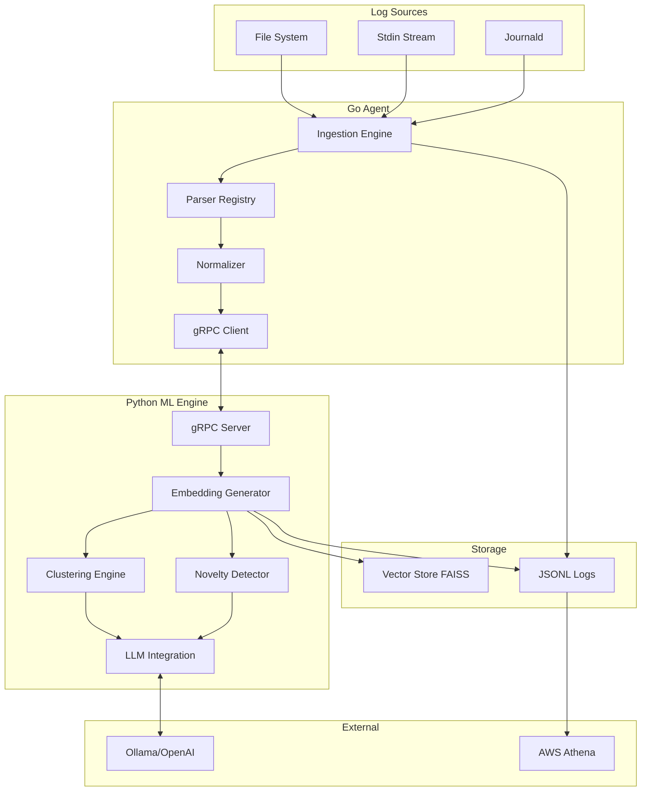

## Component Architecture

### Go Agent Components

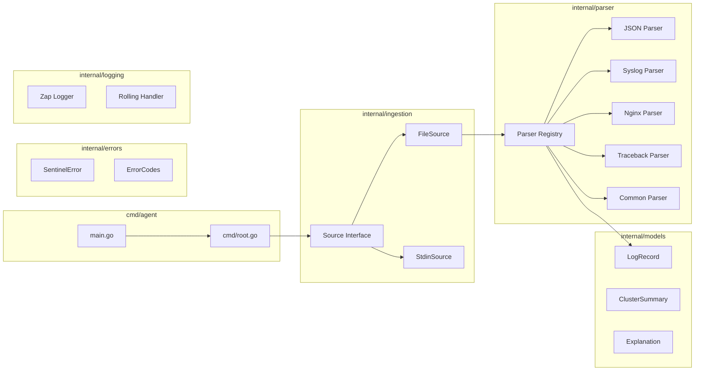

### Python ML Engine Components

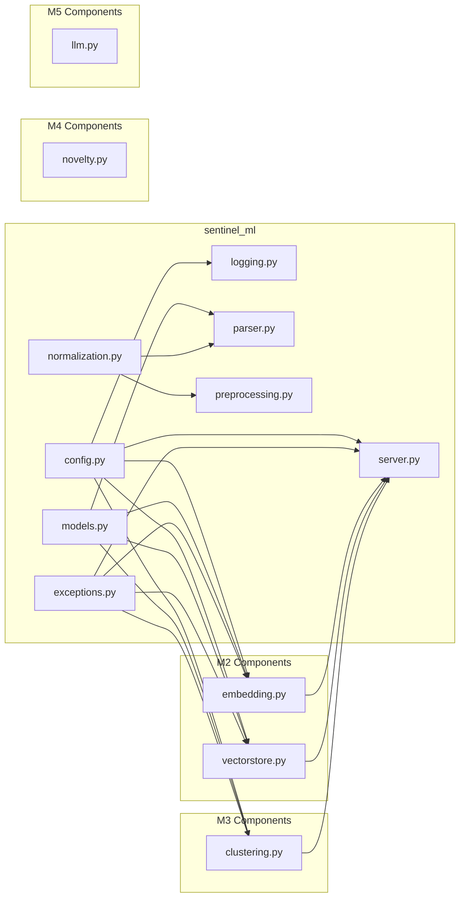

## Embedding Architecture (M2)

The embedding subsystem provides semantic vector representations of log messages:

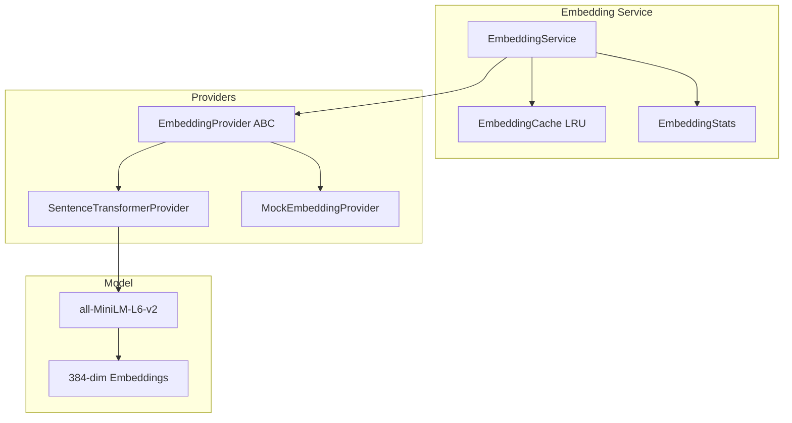

### Embedding Provider Strategy Pattern

The embedding system uses the Strategy pattern for provider flexibility:

| Provider | Use Case |
|----------|----------|
| `SentenceTransformerProvider` | Production - Uses sentence-transformers models |
| `MockEmbeddingProvider` | Testing - Deterministic mock embeddings |

### Embedding Cache Architecture

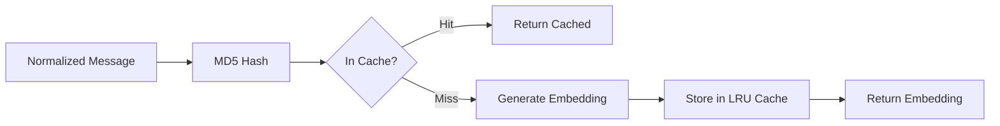

## Vector Store Architecture (M2)

The vector store provides high-performance similarity search:

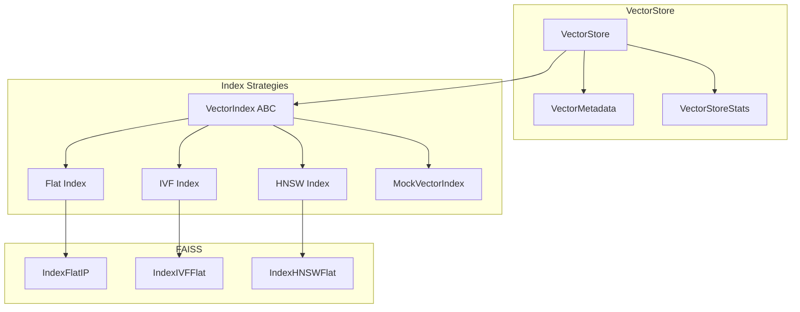

### Index Strategy Selection

| Strategy | Best For | Trade-offs |
|----------|----------|------------|
| `Flat` | Small datasets (<10K) | Exact search, slower at scale |
| `IVF` | Medium datasets (10K-1M) | Fast approximate, requires training |
| `HNSW` | Large datasets (1M+) | Very fast, higher memory |

### Persistence Model

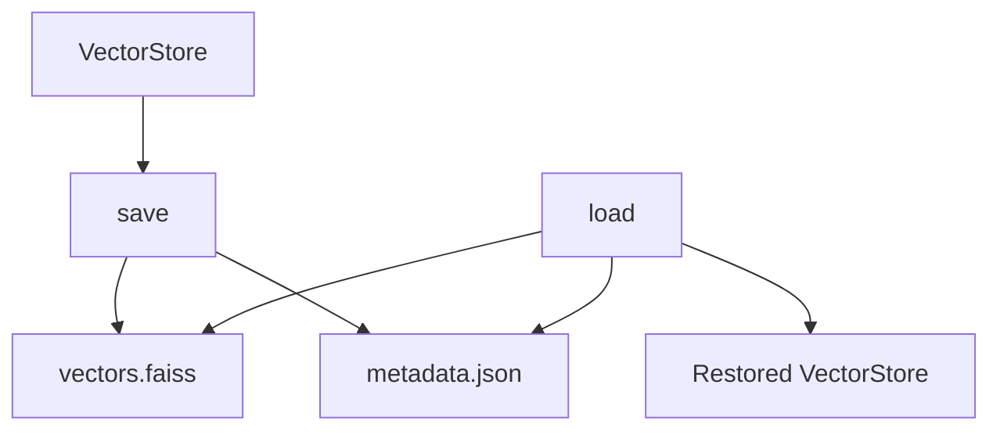

## Clustering Architecture (M3)

The clustering subsystem discovers patterns in log data using HDBSCAN:

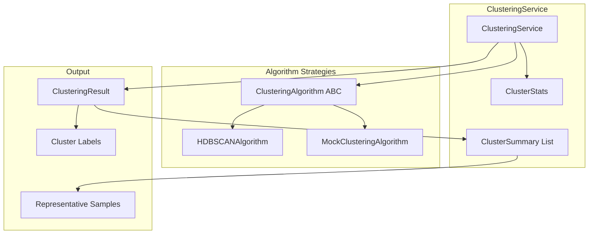

### Clustering Algorithm Strategy Pattern

The clustering system uses the Strategy pattern for algorithm flexibility:

| Algorithm | Use Case |
|-----------|----------|
| `HDBSCANAlgorithm` | Production - Density-based clustering, handles noise |
| `MockClusteringAlgorithm` | Testing - Deterministic mock clustering |

### HDBSCAN Configuration

| Parameter | Default | Description |
|-----------|---------|-------------|
| `min_cluster_size` | 5 | Minimum cluster size |
| `min_samples` | 3 | Core point threshold |
| `cluster_selection_epsilon` | 0.0 | Merge clusters within epsilon |
| `metric` | euclidean | Distance metric |

### Cluster Summary Generation

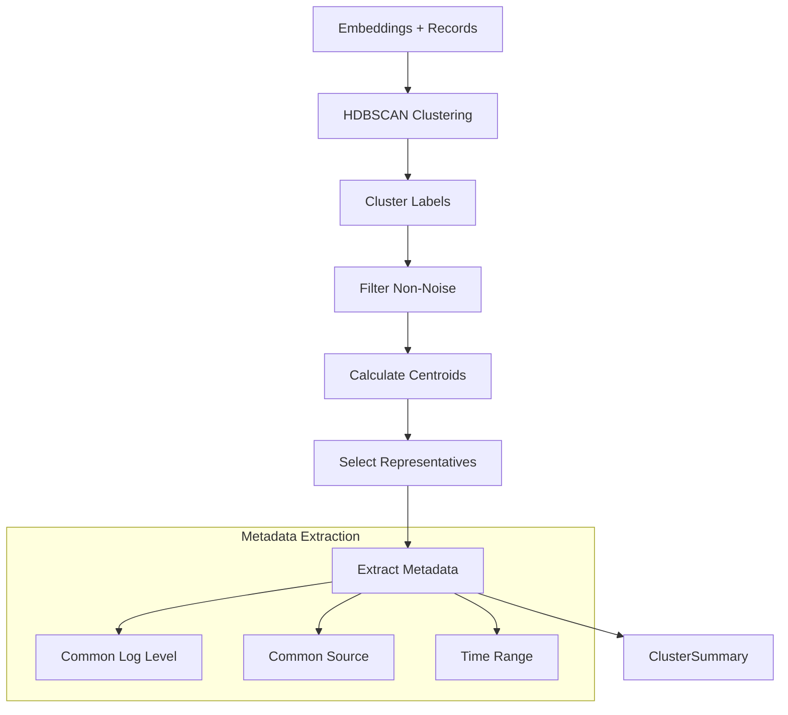

### Representative Selection Algorithm

1. Calculate cluster centroid from member embeddings
2. Compute distance from each member to centroid
3. Select N closest members as representatives
4. Extract their messages for summary

## Novelty Detection Architecture (M4)

The novelty detection subsystem identifies unusual log patterns using k-NN density estimation:

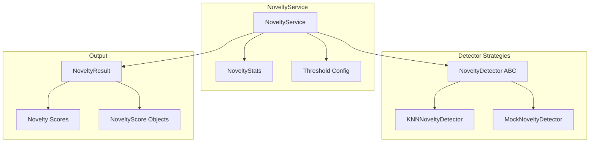

### Novelty Detector Strategy Pattern

The novelty system uses the Strategy pattern for algorithm flexibility:

| Algorithm | Use Case |
|-----------|----------|
| `KNNNoveltyDetector` | Production - k-NN density-based novelty scoring |
| `MockNoveltyDetector` | Testing - Deterministic mock scores |

### k-NN Novelty Configuration

| Parameter | Default | Description |
|-----------|---------|-------------|
| `threshold` | 0.7 | Score threshold for novel classification |
| `k_neighbors` | 5 | Number of neighbors for density estimation |
| `use_density` | true | Use density-based vs distance-based scoring |

### Novelty Detection Algorithm

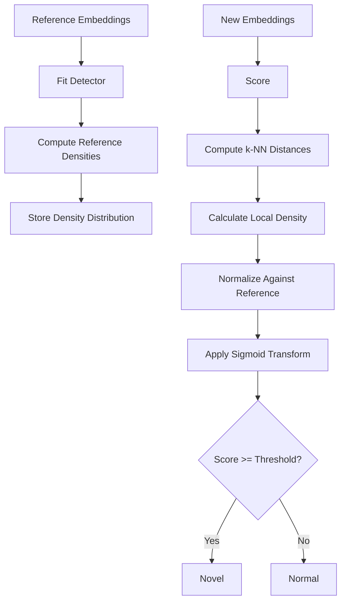

### k-NN Density Scoring

1. **Fit Phase**: Compute k-NN distances for reference embeddings
2. **Reference Distribution**: Calculate mean and std of densities
3. **Score Phase**: For new samples, compute k-NN distances to reference
4. **Density Estimation**: density = 1 / (mean k-NN distance + ε)
5. **Normalization**: z-score against reference distribution
6. **Transform**: Sigmoid to map to [0, 1] novelty score

### Novelty Score Interpretation

| Score Range | Interpretation |
|-------------|----------------|
| 0.0 - 0.3 | Normal - High density, close to known patterns |
| 0.3 - 0.5 | Slightly unusual - Moderate deviation |
| 0.5 - 0.7 | Unusual - Notable deviation from patterns |
| 0.7 - 0.9 | Novel - Significant anomaly |
| 0.9 - 1.0 | Highly novel - Extreme outlier |

## LLM Explanation Architecture (M5)

The LLM subsystem provides human-readable explanations for log patterns using large language models:

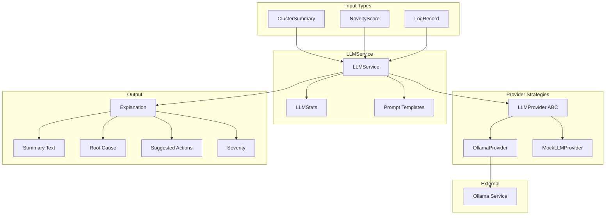

### LLM Provider Strategy Pattern

The LLM system uses the Strategy pattern for provider flexibility:

| Provider | Use Case |
|----------|----------|
| `OllamaProvider` | Production - Ollama REST API with retry logic |
| `MockLLMProvider` | Testing - Deterministic mock responses |

### LLM Configuration

| Parameter | Default | Description |
|-----------|---------|-------------|
| `provider` | ollama | LLM provider type |
| `model` | llama3.2 | Model name to use |
| `base_url` | http://localhost:11434 | Ollama server URL |
| `timeout` | 120 | Request timeout in seconds |
| `max_retries` | 3 | Maximum retry attempts |
| `temperature` | 0.1 | Response temperature (lower = more focused) |

### Explanation Types

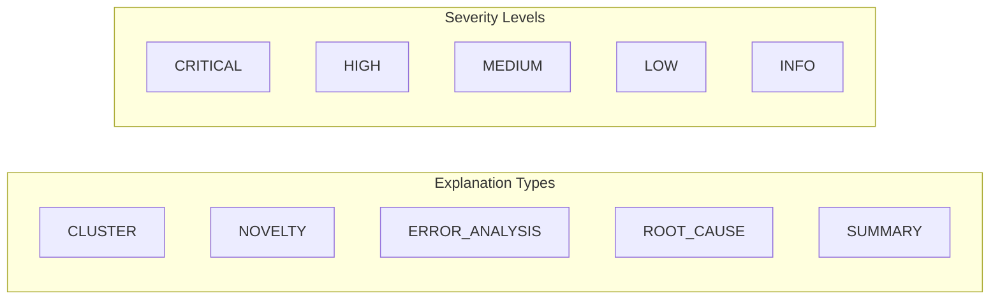

| Explanation Type | Input | Purpose |
|------------------|-------|---------|
| `CLUSTER` | ClusterSummary | Explain cluster pattern and root cause |
| `NOVELTY` | NoveltyScore | Explain why pattern is novel |
| `ERROR_ANALYSIS` | LogRecord | Analyze error and suggest fixes |
| `ROOT_CAUSE` | Multiple inputs | Deep root cause analysis |
| `SUMMARY` | Aggregated data | Executive summary of analysis |

### LLM Explanation Flow

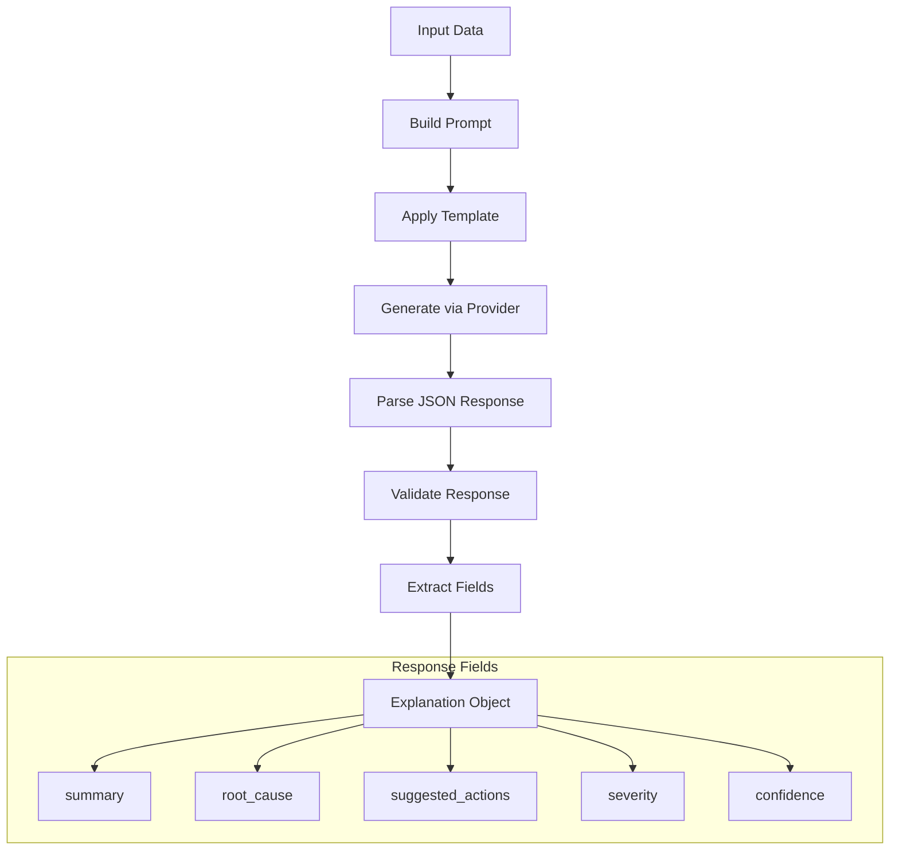

### Prompt Templates

Four specialized prompt templates optimize LLM responses:

| Template | Purpose | Key Fields |
|----------|---------|------------|
| `CLUSTER_EXPLANATION_PROMPT` | Cluster analysis | log_messages, cluster_size, common_level |
| `NOVELTY_EXPLANATION_PROMPT` | Novel pattern explanation | log_message, novelty_score, threshold |
| `ERROR_ANALYSIS_PROMPT` | Error diagnosis | error_message, log_level, source, context |
| `SUMMARY_PROMPT` | Executive summary | total_logs, n_clusters, n_novel |

### Retry Logic with Exponential Backoff

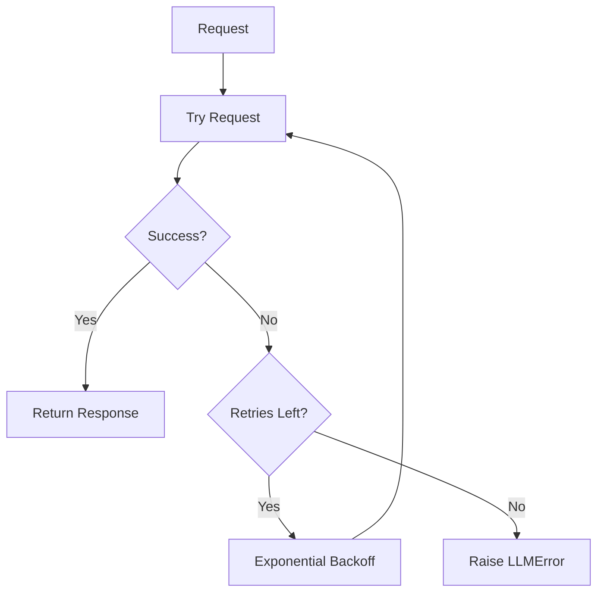

Backoff formula: `delay = 2^attempt` seconds

### Response Parsing

The LLMService handles various LLM response formats:

1. **Pure JSON**: Directly parsed
2. **Markdown Code Block**: Extracts JSON from ```json``` blocks
3. **Invalid JSON**: Raises `LLMError.invalid_response()`

### LLM Error Handling

| Error Type | Error Code | Retryable |
|------------|------------|-----------|
| `LLM_PROVIDER_ERROR` | 6000 | Yes |
| `LLM_RATE_LIMITED` | 6001 | Yes |
| `LLM_CONTEXT_TOO_LONG` | 6002 | No |
| `LLM_INVALID_RESPONSE` | 6003 | Yes |

## Layer Architecture

The system follows a layered architecture pattern:

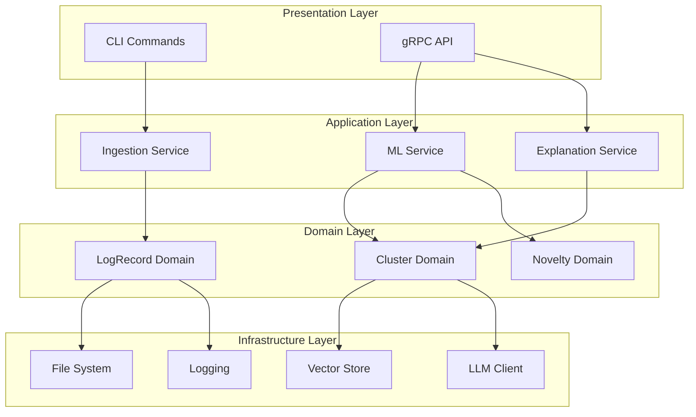

## SOLID Design Principles

### Single Responsibility Principle (SRP)

Each module has one clear responsibility:

| Module | Responsibility |
|--------|---------------|
| `parser.go` | Parse log lines into structured records |
| `source.go` | Read logs from various sources |
| `logging.go` | Structured JSONL logging |
| `errors.go` | Error types and handling |
| `normalization.py` | Mask sensitive data in logs |
| `exceptions.py` | Exception hierarchy |

### Open/Closed Principle (OCP)

- Parser Registry allows adding new parsers without modifying existing code
- Source interface enables new ingestion sources
- Normalization pipeline supports custom rules

### Liskov Substitution Principle (LSP)

- All parsers implement the Parser interface
- All sources implement the Source interface
- All exceptions inherit from SentinelError

### Interface Segregation Principle (ISP)

- Small, focused interfaces (Parser, Source)
- No forced implementation of unused methods

### Dependency Inversion Principle (DIP)

- Components depend on abstractions (interfaces)
- Logging, parsing, and sources are injected

## Concurrency Model

### Go Agent

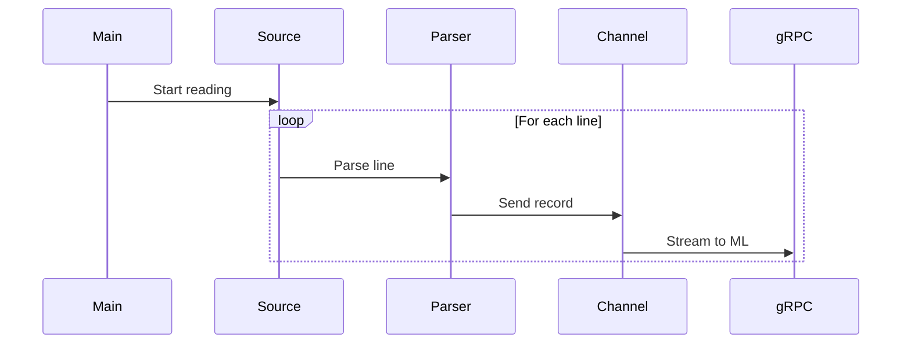

### Python ML Engine

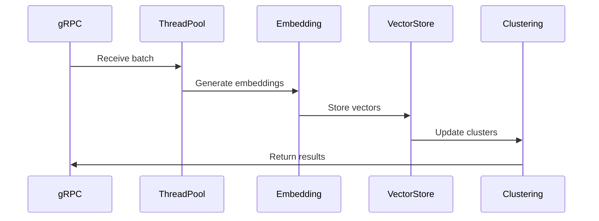

## Deployment Architecture

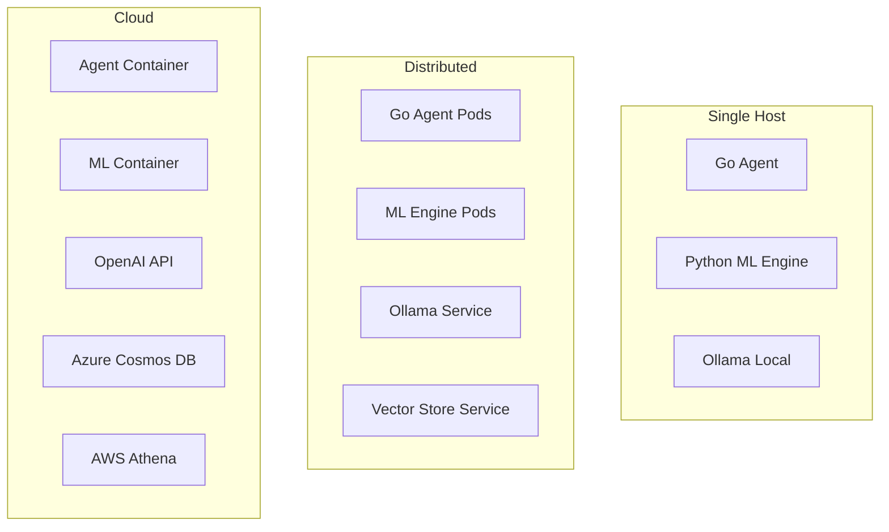

## Technology Stack

| Layer | Technology | Purpose |
|-------|-----------|---------|
| Agent | Go 1.22 | High-performance log ingestion |
| CLI | Cobra | Command-line interface |
| Logging | Zap + Lumberjack | JSONL rolling logs |
| ML Engine | Python 3.10+ | ML/AI processing |
| Config | Pydantic | Configuration management |
| Logging | Structlog | Structured logging |
| IPC | gRPC + Protobuf | Agent-ML communication |
| Vector Store | FAISS | Embedding storage and search |
| Clustering | HDBSCAN | Log pattern clustering |
| LLM | Ollama/OpenAI | Log explanation generation |

## Security Considerations

1. **Data Masking**: PII/sensitive data masked during normalization
2. **Log Isolation**: Logs stored in JSONL for audit trails
3. **gRPC Security**: TLS encryption for production
4. **Error Handling**: No sensitive data in error messages
