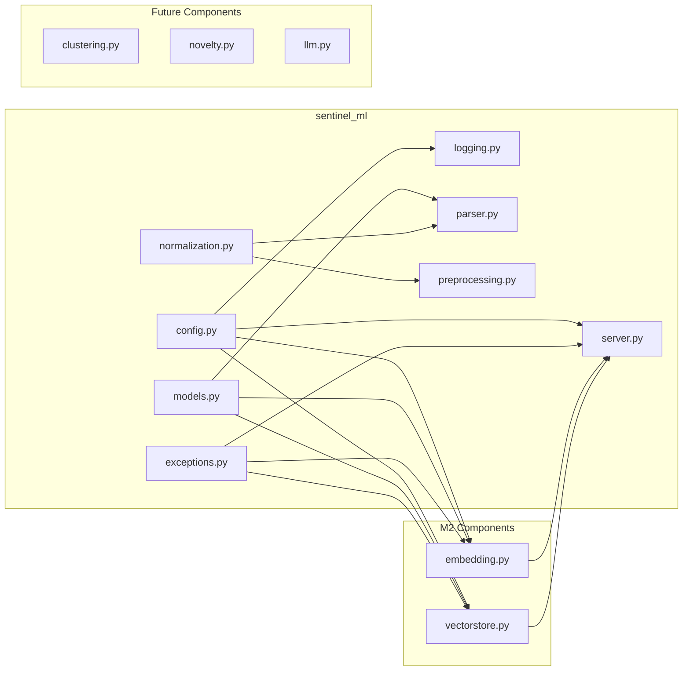

# System Architecture

## Overview

Sentinel Log AI is a polyglot log intelligence system that combines Go's performance for log ingestion with Python's ML/AI ecosystem for intelligent analysis.

## High-Level Architecture

## Component Architecture

### Go Agent Components

### Python ML Engine Components

## Embedding Architecture (M2)

The embedding subsystem provides semantic vector representations of log messages:

### Embedding Provider Strategy Pattern

The embedding system uses the Strategy pattern for provider flexibility:

| Provider | Use Case |
|----------|----------|
| `SentenceTransformerProvider` | Production - Uses sentence-transformers models |
| `MockEmbeddingProvider` | Testing - Deterministic mock embeddings |

### Embedding Cache Architecture

## Vector Store Architecture (M2)

The vector store provides high-performance similarity search:

### Index Strategy Selection

| Strategy | Best For | Trade-offs |
|----------|----------|------------|
| `Flat` | Small datasets (<10K) | Exact search, slower at scale |
| `IVF` | Medium datasets (10K-1M) | Fast approximate, requires training |
| `HNSW` | Large datasets (1M+) | Very fast, higher memory |

### Persistence Model

## Layer Architecture

The system follows a layered architecture pattern:

```mermaid
graph TB
    subgraph "Presentation Layer"
        CLI[CLI Commands]
        GRPC[gRPC API]
    end

    subgraph "Application Layer"
        ING_SVC[Ingestion Service]
        ML_SVC[ML Service]
        EXPLAIN_SVC[Explanation Service]
    end

    subgraph "Domain Layer"
        LR_DOM[LogRecord Domain]
        CLUST_DOM[Cluster Domain]
        NOV_DOM[Novelty Domain]
    end

    subgraph "Infrastructure Layer"
        FS_INF[File System]
        VS_INF[Vector Store]
        LLM_INF[LLM Client]
        LOG_INF[Logging]
    end

    CLI --> ING_SVC
    GRPC --> ML_SVC
    GRPC --> EXPLAIN_SVC

    ING_SVC --> LR_DOM
    ML_SVC --> CLUST_DOM
    ML_SVC --> NOV_DOM
    EXPLAIN_SVC --> CLUST_DOM

    LR_DOM --> FS_INF
    LR_DOM --> LOG_INF
    CLUST_DOM --> VS_INF
    CLUST_DOM --> LLM_INF
```

## SOLID Design Principles

### Single Responsibility Principle (SRP)

Each module has one clear responsibility:

| Module | Responsibility |
|--------|---------------|
| `parser.go` | Parse log lines into structured records |
| `source.go` | Read logs from various sources |
| `logging.go` | Structured JSONL logging |
| `errors.go` | Error types and handling |
| `normalization.py` | Mask sensitive data in logs |
| `exceptions.py` | Exception hierarchy |

### Open/Closed Principle (OCP)

- Parser Registry allows adding new parsers without modifying existing code
- Source interface enables new ingestion sources
- Normalization pipeline supports custom rules

### Liskov Substitution Principle (LSP)

- All parsers implement the Parser interface
- All sources implement the Source interface
- All exceptions inherit from SentinelError

### Interface Segregation Principle (ISP)

- Small, focused interfaces (Parser, Source)
- No forced implementation of unused methods

### Dependency Inversion Principle (DIP)

- Components depend on abstractions (interfaces)
- Logging, parsing, and sources are injected

## Concurrency Model

### Go Agent

### Python ML Engine

## Deployment Architecture

## Technology Stack

| Layer | Technology | Purpose |
|-------|-----------|---------|
| Agent | Go 1.22 | High-performance log ingestion |
| CLI | Cobra | Command-line interface |
| Logging | Zap + Lumberjack | JSONL rolling logs |
| ML Engine | Python 3.10+ | ML/AI processing |
| Config | Pydantic | Configuration management |
| Logging | Structlog | Structured logging |
| IPC | gRPC + Protobuf | Agent-ML communication |
| Vector Store | FAISS | Embedding storage and search |
| Clustering | HDBSCAN | Log pattern clustering |
| LLM | Ollama/OpenAI | Log explanation generation |

## Security Considerations

1. **Data Masking**: PII/sensitive data masked during normalization
2. **Log Isolation**: Logs stored in JSONL for audit trails
3. **gRPC Security**: TLS encryption for production
4. **Error Handling**: No sensitive data in error messages
