# Data Flow Documentation

## Overview

This document describes the end-to-end data flow in Sentinel Log AI, from log ingestion to insight generation.

## Complete Data Flow

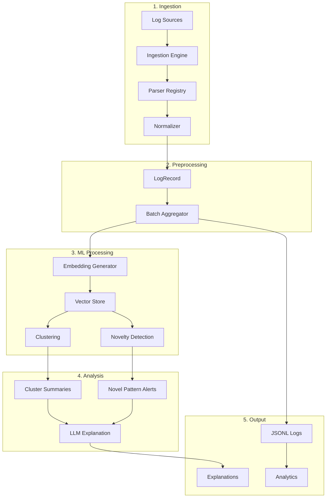

## Phase 1: Log Ingestion

### Source Reading

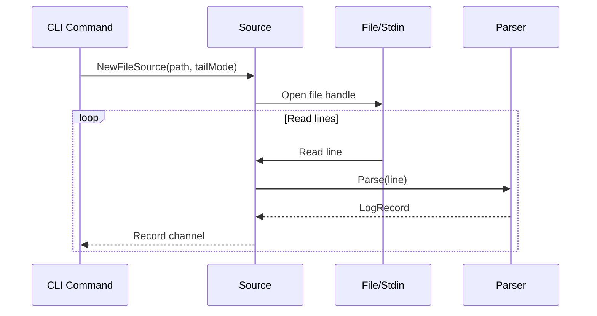

### Parser Selection

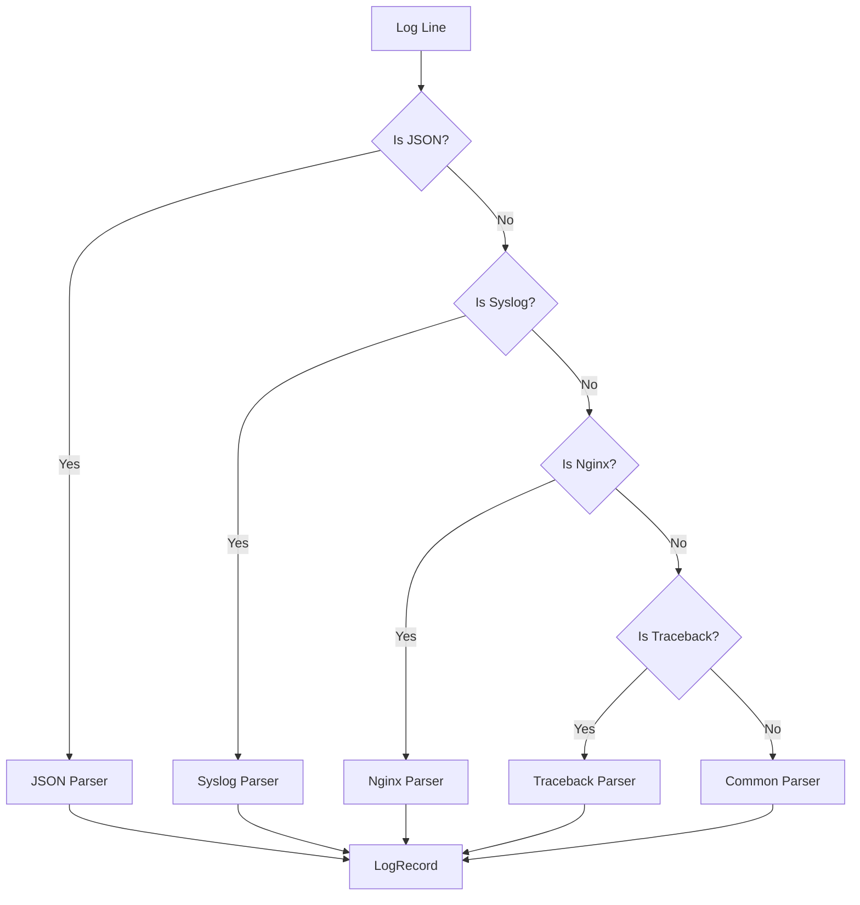

## Phase 2: Normalization

### Masking Pipeline

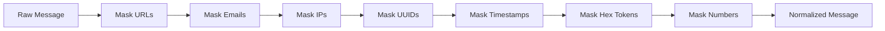

### Normalization Rules

| Order | Pattern | Replacement | Example |
|-------|---------|-------------|---------|
| 1 | URLs | `<URL>` | `https://example.com` -> `<URL>` |
| 2 | Emails | `<EMAIL>` | `user@domain.com` -> `<EMAIL>` |
| 3 | IPv4 | `<IP>` | `192.168.1.1` -> `<IP>` |
| 4 | UUIDs | `<UUID>` | `550e8400-...` -> `<UUID>` |
| 5 | ISO Timestamps | `<TIMESTAMP>` | `2024-01-15T10:30:00Z` -> `<TIMESTAMP>` |
| 6 | Hex Tokens | `<HEX>` | `abc123def456` -> `<HEX>` |
| 7 | Long Numbers | `<NUM>` | `1234567890` -> `<NUM>` |

## Phase 3: gRPC Communication

### Message Flow

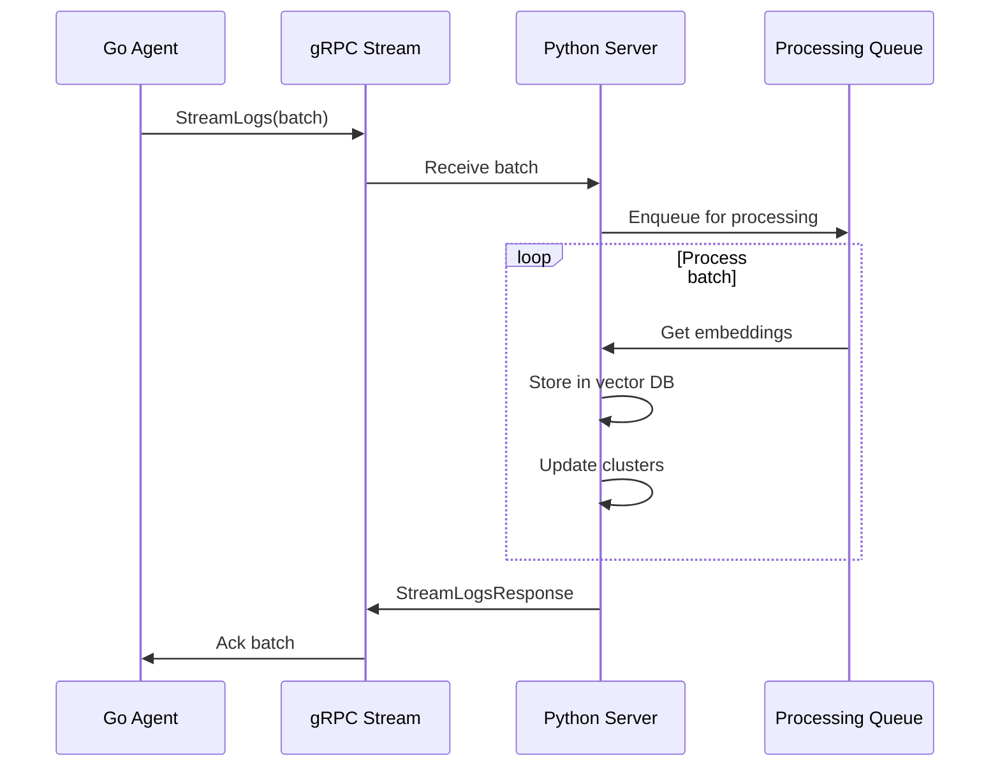

### Proto Message Structure

```protobuf
message LogRecord {
    string id = 1;
    string raw_message = 2;
    string normalized_message = 3;
    string level = 4;
    google.protobuf.Timestamp timestamp = 5;
    string source = 6;
    map<string, string> attributes = 7;
}

message StreamLogsRequest {
    repeated LogRecord records = 1;
}

message StreamLogsResponse {
    int32 processed_count = 1;
    repeated string errors = 2;
}
```

## Phase 4: ML Processing

### Embedding Generation

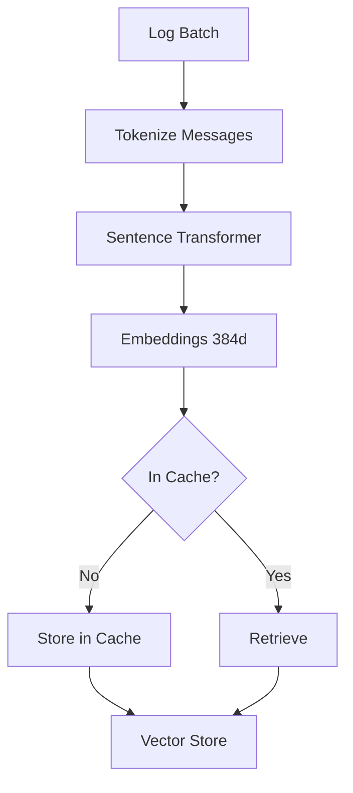

### Embedding Generation (M2)

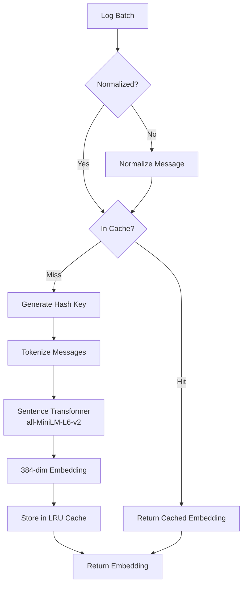

### Embedding Cache Flow

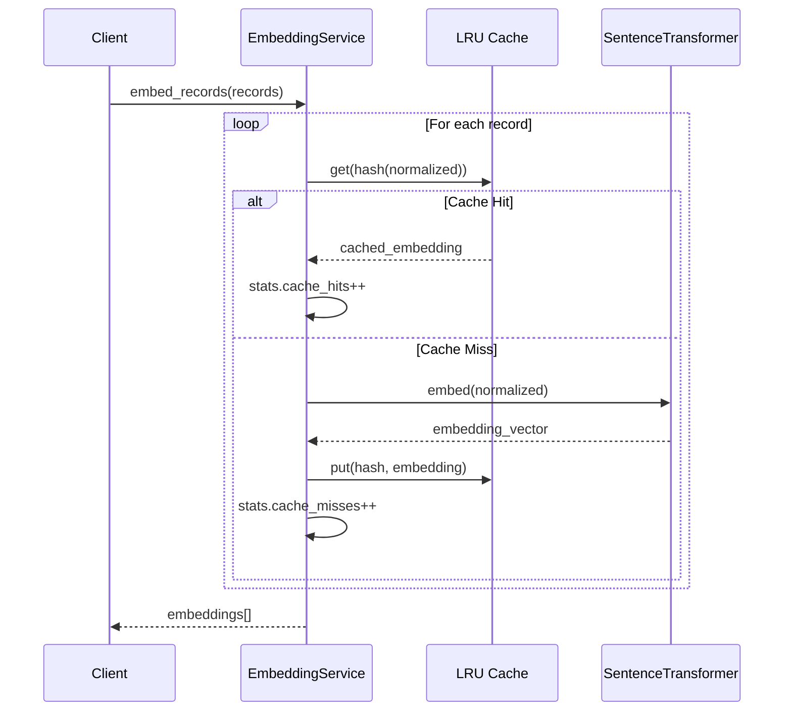

### Vector Store Operations (M2)

```mermaid
flowchart TD
    subgraph "Add Flow"
        EMB[Embeddings] --> NORM2[L2 Normalize]
        NORM2 --> INDEX[Add to FAISS Index]
        INDEX --> META[Store Metadata]
        META --> ID[Return IDs]
    end

    subgraph "Search Flow"
        QUERY[Query Vector] --> NORM3[L2 Normalize]
        NORM3 --> SEARCH[FAISS Search]
        SEARCH --> DIST[Distances + Indices]
        DIST --> LOOKUP[Lookup Metadata]
        LOOKUP --> RESULTS[SearchResult[]]
    end
```

### Vector Store Persistence

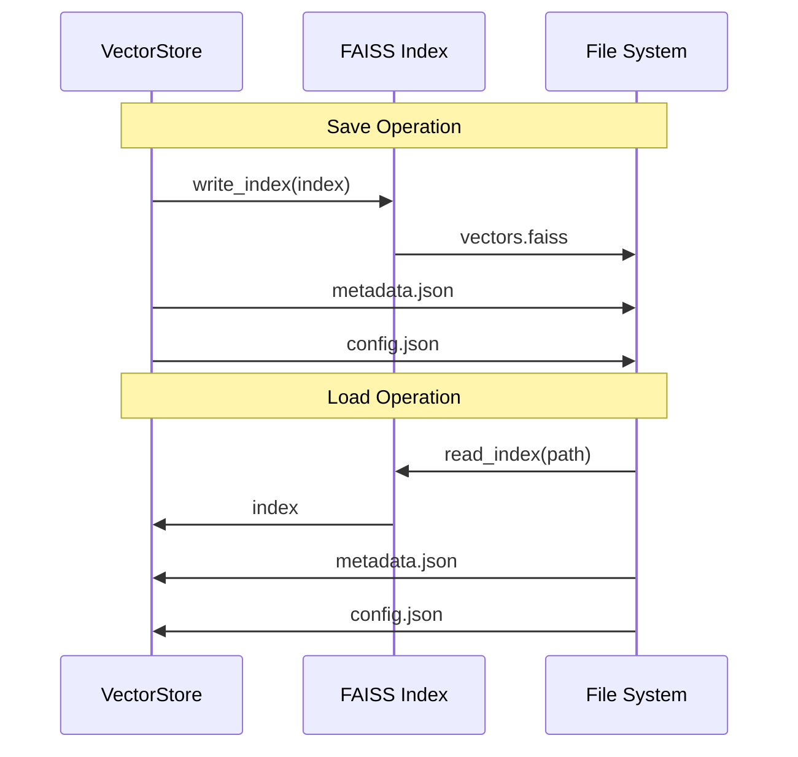

### Clustering Pipeline

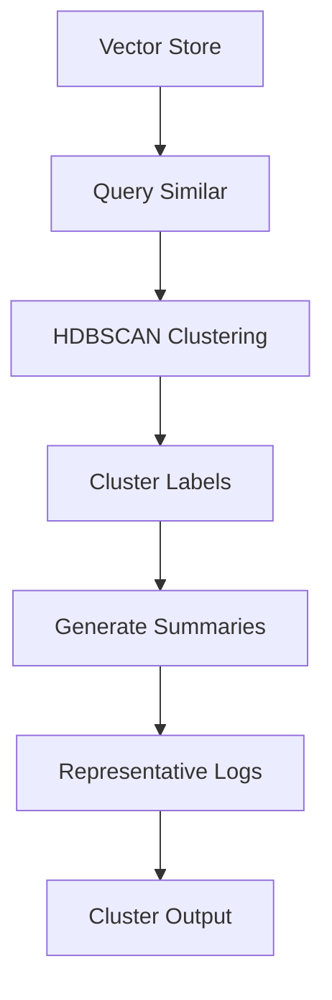

### Novelty Detection

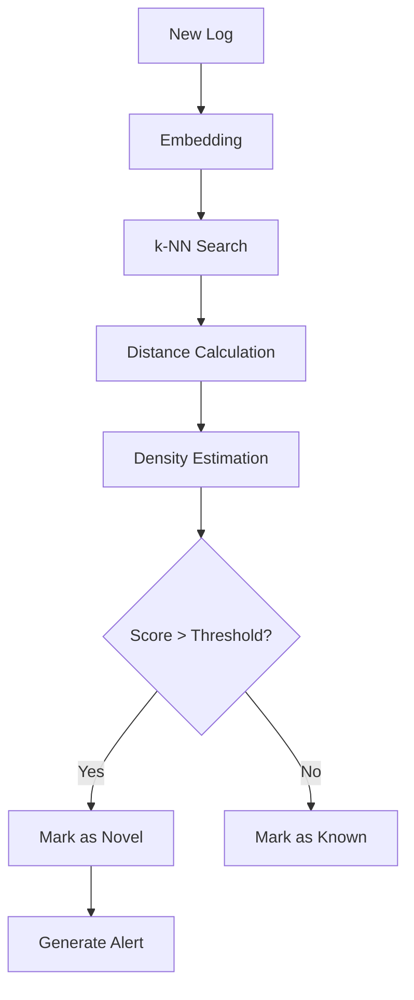

## Phase 5: LLM Explanation

### Explanation Flow

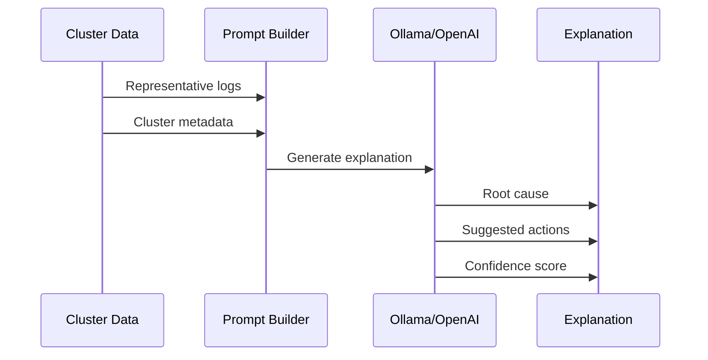

### Prompt Template

```
Analyze these log messages from cluster {cluster_id}:

{representative_logs}

Cluster Statistics:
- Size: {count} messages
- Time Range: {first_seen} to {last_seen}
- Common Level: {dominant_level}

Provide:
1. Probable root cause
2. Suggested next steps
3. Severity assessment
4. Confidence score (0-1)
```

## Phase 6: Logging and Analytics

### JSONL Log Format

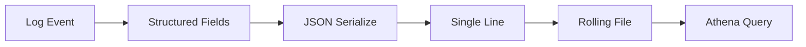

### Log Entry Structure

```json
{
    "timestamp": "2024-01-15T10:30:00.000Z",
    "level": "info",
    "service": "sentinel-agent",
    "hostname": "prod-server-01",
    "pid": 12345,
    "msg": "ingestion_completed",
    "path": "/var/log/app.log",
    "count": 1000,
    "duration": "2.5s",
    "request_id": "req-abc123"
}
```

### Athena Query Examples

```sql
-- Find all errors in the last hour
SELECT * FROM sentinel_logs
WHERE level = 'error'
AND timestamp > current_timestamp - interval '1' hour;

-- Count logs by service and level
SELECT service, level, count(*) as cnt
FROM sentinel_logs
WHERE date = current_date
GROUP BY service, level
ORDER BY cnt DESC;

-- Find slow operations
SELECT msg, duration, path
FROM sentinel_logs
WHERE duration > 5.0
ORDER BY duration DESC
LIMIT 100;
```

## Error Flow

### Error Handling Chain

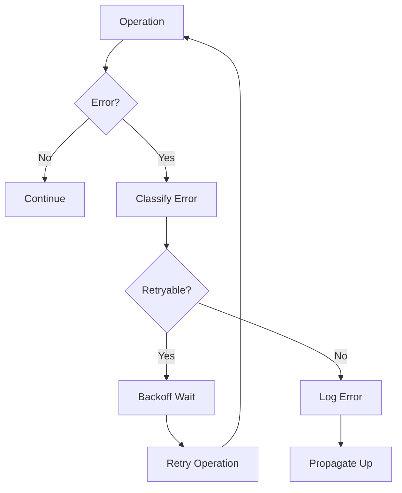

### Error Categories

| Category | Code Range | Retryable | Example |
|----------|-----------|-----------|---------|
| Configuration | 1xxx | No | Invalid config file |
| Ingestion | 2xxx | Partial | File not found (no), Timeout (yes) |
| Processing | 3xxx | Yes | OOM during embedding |
| Storage | 4xxx | Yes | Write failure |
| Communication | 5xxx | Yes | gRPC timeout |
| LLM | 6xxx | Yes | Rate limiting |
