# Data Flow Documentation

## Overview

This document describes the end-to-end data flow in Sentinel Log AI, from log ingestion to insight generation.

## Complete Data Flow


## Phase 1: Log Ingestion

### Source Reading


### Parser Selection


## Phase 2: Normalization

### Masking Pipeline


### Normalization Rules

| Order | Pattern | Replacement | Example |
|-------|---------|-------------|---------|
| 1 | URLs | `<URL>` | `https://example.com` -> `<URL>` |
| 2 | Emails | `<EMAIL>` | `user@domain.com` -> `<EMAIL>` |
| 3 | IPv4 | `<IP>` | `192.168.1.1` -> `<IP>` |
| 4 | UUIDs | `<UUID>` | `550e8400-...` -> `<UUID>` |
| 5 | ISO Timestamps | `<TIMESTAMP>` | `2024-01-15T10:30:00Z` -> `<TIMESTAMP>` |
| 6 | Hex Tokens | `<HEX>` | `abc123def456` -> `<HEX>` |
| 7 | Long Numbers | `<NUM>` | `1234567890` -> `<NUM>` |

## Phase 3: gRPC Communication

### Message Flow


### Proto Message Structure

```protobuf
message LogRecord {
    string id = 1;
    string raw_message = 2;
    string normalized_message = 3;
    string level = 4;
    google.protobuf.Timestamp timestamp = 5;
    string source = 6;
    map<string, string> attributes = 7;
}

message StreamLogsRequest {
    repeated LogRecord records = 1;
}

message StreamLogsResponse {
    int32 processed_count = 1;
    repeated string errors = 2;
}
```

## Phase 4: ML Processing

### Embedding Generation


### Embedding Generation (M2)


### Embedding Cache Flow


### Vector Store Operations (M2)

```mermaid
flowchart TD
    subgraph "Add Flow"
        EMB[Embeddings] --> NORM2[L2 Normalize]
        NORM2 --> INDEX[Add to FAISS Index]
        INDEX --> META[Store Metadata]
        META --> ID[Return IDs]
    end

    subgraph "Search Flow"
        QUERY[Query Vector] --> NORM3[L2 Normalize]
        NORM3 --> SEARCH[FAISS Search]
        SEARCH --> DIST[Distances + Indices]
        DIST --> LOOKUP[Lookup Metadata]
        LOOKUP --> RESULTS[SearchResult[]]
    end
```

### Vector Store Persistence


### Clustering Pipeline (M3)


### Clustering Service Sequence


### Representative Selection Algorithm


### Novelty Detection Pipeline (M4)


### Novelty Detection Sequence


### k-NN Density Calculation

```mermaid
flowchart TD
    EMB[Embedding Vector] --> DIST[Compute Pairwise Distances]
    DIST --> PART[Partition k Smallest]
    PART --> KNN_D[k-NN Distances]
    KNN_D --> MEAN[Mean Distance]
    MEAN --> INV[Density = 1 / Mean + ε]
    INV --> DENS[Local Density Estimate]
```



### Novelty Score Interpretation Flow


### Full Pipeline: Ingest, Embed, and Detect


## Phase 5: LLM Explanation (M5)

### LLM Explanation Flow


### Prompt Building Flow


### Response Parsing Flow

```mermaid
flowchart TD
    RESPONSE[LLM Response Text] --> CHECK{Is Pure JSON?}
    CHECK -->|Yes| PARSE[Parse JSON]
    CHECK -->|No| REGEX[Extract from Markdown]
    REGEX --> FOUND{JSON Found?}
    FOUND -->|Yes| PARSE
    FOUND -->|No| ERROR[Raise LLMError]
    
    PARSE --> VALIDATE{Valid Fields?}
    VALIDATE -->|Yes| EXTRACT[Extract Fields]
    VALIDATE -->|No| DEFAULTS[Use Default Values]
    
    EXTRACT --> BUILD[Build Explanation]
    DEFAULTS --> BUILD
    BUILD --> SEVERITY[Map Severity Enum]
    SEVERITY --> RESULT[Explanation Object]
```

### Explanation Output Structure

```mermaid
graph LR
    subgraph "Explanation"
        ID[id: UUID]
        TYPE[explanation_type]
        SUMMARY[summary: str]
        ROOT[root_cause: str]
        ACTIONS[suggested_actions: list]
        SEV[severity: Severity]
        CONF[confidence: float]
        MODEL[model: str]
        TOKENS[token counts]
        TIME[response_time]
        META[metadata: dict]
    end
```

### Full Pipeline: Cluster to Explanation

```mermaid
sequenceDiagram
    participant Client
    participant Server as MLServiceServicer
    participant Cluster as ClusteringService
    participant LLM as LLMService
    participant Ollama as Ollama API

    Client->>Server: ingest_embed_and_cluster(records)
    Server->>Server: preprocess + embed + cluster
    Server-->>Client: ClusteringResult
    
    loop For each cluster
        Client->>Server: explain_cluster(cluster_summary)
        Server->>LLM: explain_cluster(summary)
        LLM->>LLM: build_prompt()
        LLM->>Ollama: POST /api/generate
        Ollama-->>LLM: JSON response
        LLM->>LLM: parse_response()
        LLM-->>Server: Explanation
        Server-->>Client: Explanation
    end
```

### LLM Provider Selection

```mermaid
flowchart TD
    CONFIG[LLMConfig] --> PROVIDER{provider type}
    PROVIDER -->|ollama| OLLAMA[OllamaProvider]
    PROVIDER -->|mock| MOCK[MockLLMProvider]
    
    OLLAMA --> OPTS[Configure options]
    OPTS --> URL[base_url: localhost:11434]
    OPTS --> MODEL[model: llama3.2]
    OPTS --> RETRY[max_retries: 3]
    OPTS --> TIMEOUT[timeout: 120s]
    
    MOCK --> DET[Deterministic responses]
    DET --> TEST[For unit testing]
```

### Error Handling in LLM Flow

```mermaid
flowchart TD
    GENERATE[Generate Request] --> TRY{Try Request}
    TRY -->|Success| PARSE[Parse Response]
    TRY -->|URLError| RETRY_CHECK{Retries Left?}
    TRY -->|Timeout| RETRY_CHECK
    TRY -->|HTTPError 429| RATE[Rate Limited]
    
    RATE --> WAIT[Wait retry_after]
    WAIT --> TRY
    
    RETRY_CHECK -->|Yes| BACKOFF[Exponential Backoff]
    BACKOFF --> TRY
    RETRY_CHECK -->|No| FAIL[Raise LLMError.provider_error]
    
    PARSE --> VALID{Valid JSON?}
    VALID -->|Yes| SUCCESS[Return Explanation]
    VALID -->|No| INV[Raise LLMError.invalid_response]
```

### Prompt Template

```
Analyze these log messages from cluster {cluster_id}:

{representative_logs}

Cluster Statistics:
- Size: {count} messages
- Time Range: {first_seen} to {last_seen}
- Common Level: {dominant_level}

Provide:
1. Probable root cause
2. Suggested next steps
3. Severity assessment
4. Confidence score (0-1)
```

## Phase 6: Logging and Analytics

### JSONL Log Format

```mermaid
flowchart LR
    EVENT[Log Event] --> STRUCT[Structured Fields]
    STRUCT --> JSON[JSON Serialize]
    JSON --> LINE[Single Line]
    LINE --> FILE[Rolling File]
    FILE --> ATHENA[Athena Query]
```

### Log Entry Structure

```json
{
    "timestamp": "2024-01-15T10:30:00.000Z",
    "level": "info",
    "service": "sentinel-agent",
    "hostname": "prod-server-01",
    "pid": 12345,
    "msg": "ingestion_completed",
    "path": "/var/log/app.log",
    "count": 1000,
    "duration": "2.5s",
    "request_id": "req-abc123"
}
```

### Athena Query Examples

```sql
-- Find all errors in the last hour
SELECT * FROM sentinel_logs
WHERE level = 'error'
AND timestamp > current_timestamp - interval '1' hour;

-- Count logs by service and level
SELECT service, level, count(*) as cnt
FROM sentinel_logs
WHERE date = current_date
GROUP BY service, level
ORDER BY cnt DESC;

-- Find slow operations
SELECT msg, duration, path
FROM sentinel_logs
WHERE duration > 5.0
ORDER BY duration DESC
LIMIT 100;
```

## Error Flow

### Error Handling Chain

```mermaid
flowchart TD
    OP[Operation] --> ERR{Error?}
    ERR -->|No| SUCCESS[Continue]
    ERR -->|Yes| CLASSIFY[Classify Error]
    CLASSIFY --> RETRY{Retryable?}
    RETRY -->|Yes| WAIT[Backoff Wait]
    WAIT --> RETRY_OP[Retry Operation]
    RETRY_OP --> OP
    RETRY -->|No| LOG[Log Error]
    LOG --> PROPAGATE[Propagate Up]
```

### Error Categories

| Category | Code Range | Retryable | Example |
|----------|-----------|-----------|---------|
| Configuration | 1xxx | No | Invalid config file |
| Ingestion | 2xxx | Partial | File not found (no), Timeout (yes) |
| Processing | 3xxx | Yes | OOM during embedding |
| Storage | 4xxx | Yes | Write failure |
| Communication | 5xxx | Yes | gRPC timeout |
| LLM | 6xxx | Yes | Rate limiting |

## CLI Output Flow (M6)

### Console Output Flow

```mermaid
flowchart TD
    DATA[Analysis Results] --> CONSOLE[Console]
    
    CONSOLE --> THEME[Apply Theme]
    THEME --> FORMAT{Output Format?}
    
    FORMAT -->|TEXT| TEXT_OUT[Text Output]
    FORMAT -->|JSON| JSON_OUT[JSON Output]
    FORMAT -->|TABLE| TABLE_OUT[Rich Tables]
    FORMAT -->|COMPACT| COMPACT_OUT[Minimal Output]
    
    TEXT_OUT --> TERMINAL[Terminal]
    JSON_OUT --> TERMINAL
    TABLE_OUT --> TERMINAL
    COMPACT_OUT --> TERMINAL
```

### Report Generation Flow

```mermaid
flowchart TD
    RESULTS[Analysis Results] --> REPORT_DATA[ReportData]
    
    REPORT_DATA --> MARKDOWN[Markdown Reporter]
    REPORT_DATA --> HTML[HTML Reporter]
    
    MARKDOWN --> TOC[Generate TOC]
    TOC --> SUMMARY[Executive Summary]
    SUMMARY --> CLUSTERS[Cluster Details]
    CLUSTERS --> NOVELTY[Novelty Section]
    NOVELTY --> EXPLAIN[Explanations]
    EXPLAIN --> MD_FILE[.md File]
    
    HTML --> CSS[Embed CSS]
    CSS --> RENDER[Render Sections]
    RENDER --> HTML_FILE[.html File]
```

### Progress Tracking Flow

```mermaid
sequenceDiagram
    participant User as User
    participant CLI as CLI
    participant Tracker as ProgressTracker
    participant Console as Console

    User->>CLI: Run analysis
    CLI->>Tracker: Create tracker
    Tracker->>Console: Show spinner
    
    loop Process batches
        CLI->>Tracker: Update progress
        Tracker->>Console: Update display
        Note over Console: Show ETA, rate
    end
    
    CLI->>Tracker: Complete
    Tracker->>Console: Show success
```

### Profiling Flow

```mermaid
flowchart TD
    ENTRY[Function Entry] --> START[Start Timer]
    START --> EXEC[Execute Code]
    EXEC --> NESTED{Nested Measure?}
    NESTED -->|Yes| CHILD[Child Timer]
    CHILD --> EXEC
    NESTED -->|No| END[End Timer]
    END --> RECORD[Record Timing]
    RECORD --> REPORT[Generate Report]
    
    subgraph "Timing Entry"
        REPORT --> NAME[Operation Name]
        REPORT --> DURATION[Duration ms]
        REPORT --> PARENT[Parent Operation]
    end
```

### Configuration Flow

```mermaid
flowchart TD
    CMD[Config Command] --> ACTION{Action?}
    
    ACTION -->|init| GEN[Generate Config]
    GEN --> TEMPLATE[Default Template]
    TEMPLATE --> WRITE[Write YAML]
    
    ACTION -->|validate| LOAD[Load YAML]
    LOAD --> PARSE[Parse Sections]
    PARSE --> CHECK[Validate Values]
    CHECK --> RESULT{Valid?}
    RESULT -->|Yes| OK[Show Success]
    RESULT -->|No| ERRORS[Show Errors]
    
    ACTION -->|show| READ[Read Config]
    READ --> FORMAT[Format Display]
    FORMAT --> OUTPUT[Console Output]
```

## Phase 8: Alerting and Notifications

### Watch Daemon Flow

```mermaid
flowchart TD
    START[Start Daemon] --> INIT[Initialize]
    INIT --> DISCOVER[Discover Files]
    DISCOVER --> RECORD[Record Initial Positions]
    RECORD --> POLL{Poll Loop}
    
    POLL --> CHECK[Check Files]
    CHECK --> NEW{New Lines?}
    NEW -->|No| WAIT[Wait Interval]
    WAIT --> POLL
    
    NEW -->|Yes| READ[Read New Lines]
    READ --> DETECT[Run Novelty Detector]
    DETECT --> NOVEL{Score >= Threshold?}
    
    NOVEL -->|No| POLL
    NOVEL -->|Yes| CREATE[Create AlertEvent]
    CREATE --> NOTIFY[Notify All Notifiers]
    NOTIFY --> POLL
    
    POLL -->|Stop Signal| CLEANUP[Cleanup]
    CLEANUP --> END[Stopped]
```

### Alert Routing Decision Flow

```mermaid
flowchart TD
    EVENT[AlertEvent] --> ROUTER[Alert Router]
    ROUTER --> RULES[Evaluate Rules]
    
    RULES --> R1{Rule 1 Match?}
    R1 -->|Yes| N1[Send to Notifiers]
    N1 --> STOP1{Stop on Match?}
    STOP1 -->|Yes| DONE[Routing Complete]
    STOP1 -->|No| R2{Rule 2 Match?}
    
    R1 -->|No| R2
    R2 -->|Yes| N2[Send to Notifiers]
    N2 --> STOP2{Stop on Match?}
    STOP2 -->|Yes| DONE
    STOP2 -->|No| RN{More Rules?}
    
    R2 -->|No| RN
    RN -->|Yes| CONTINUE[Continue Evaluation]
    CONTINUE --> R2
    
    RN -->|No| MATCHED{Any Matches?}
    MATCHED -->|Yes| DONE
    MATCHED -->|No| FALLBACK[Send to Fallback]
    FALLBACK --> DONE
```

### Notification Delivery Flow

```mermaid
sequenceDiagram
    participant Router as Alert Router
    participant Base as BaseNotifier
    participant Impl as Notifier Impl
    participant External as External Service

    Router->>Base: send(event)
    Base->>Base: Check enabled
    Base->>Base: Validate config
    
    loop Retry Loop
        Base->>Impl: _send_impl(event)
        Impl->>Impl: Build payload
        Impl->>External: HTTP POST
        
        alt Success
            External-->>Impl: 200 OK
            Impl-->>Base: AlertResult(SUCCESS)
            Base->>Base: Update stats
            Base-->>Router: Result
        else Failure
            External-->>Impl: Error
            Impl-->>Base: Exception
            Base->>Base: Increment retry
            alt More Retries
                Base->>Base: Wait delay
            else Max Retries
                Base->>Base: Update stats
                Base-->>Router: AlertResult(FAILED)
            end
        end
    end
```

### Health Check Aggregation

```mermaid
flowchart TD
    HC[Health Check] --> INIT[Start Check]
    INIT --> DAEMON{Watch Daemon?}
    
    DAEMON -->|Yes| CHECK_D[Check Daemon Status]
    CHECK_D --> D_STATUS{Status?}
    D_STATUS -->|RUNNING| D_OK[daemon: HEALTHY]
    D_STATUS -->|STARTING| D_DEG[daemon: DEGRADED]
    D_STATUS -->|ERROR| D_BAD[daemon: UNHEALTHY]
    
    DAEMON -->|No| NOTIFIERS
    D_OK --> NOTIFIERS
    D_DEG --> NOTIFIERS
    D_BAD --> NOTIFIERS
    
    NOTIFIERS{Notifiers?} -->|Yes| CHECK_N[Check Each Notifier]
    CHECK_N --> N_LOOP[For Each Notifier]
    N_LOOP --> N_HEALTH[health_check()]
    N_HEALTH --> N_STATUS{Healthy?}
    N_STATUS -->|Yes| N_OK[notifier: HEALTHY]
    N_STATUS -->|No| N_BAD[notifier: UNHEALTHY]
    N_OK --> N_NEXT{More?}
    N_BAD --> N_NEXT
    N_NEXT -->|Yes| N_LOOP
    N_NEXT -->|No| AGGREGATE
    
    NOTIFIERS -->|No| AGGREGATE
    
    AGGREGATE[Aggregate Status] --> WORST[Worst Status Wins]
    WORST --> RESPONSE[Build Response]
    RESPONSE --> RETURN[Return Health Status]
```
