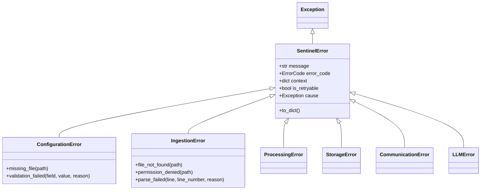
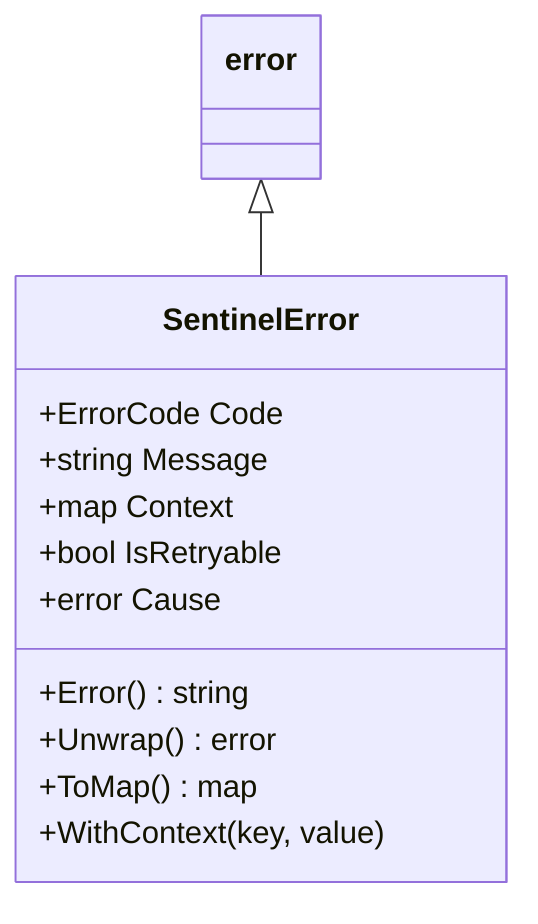
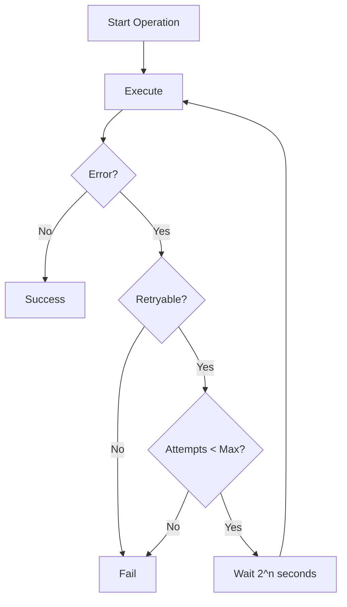

# Error Handling Guide

## Overview

Sentinel Log AI uses a structured error handling approach with:
- Typed exceptions/errors with error codes
- Retry logic for transient failures
- Structured error logging for debugging
- Clear error propagation patterns

## Error Code System

All errors use a standardized code format: `SENTINEL_XXXX`

| Range | Category | Description |
|-------|----------|-------------|
| 1xxx | Configuration | Config file and validation errors |
| 2xxx | Ingestion | Log reading and parsing errors |
| 3xxx | Processing | ML processing errors |
| 4xxx | Storage | Vector store and persistence |
| 5xxx | Communication | gRPC and network errors |
| 6xxx | LLM | LLM provider errors |
| 9xxx | General | Uncategorized errors |

## Python Exception Hierarchy



### Usage Examples

```python
from sentinel_ml.exceptions import (
    ConfigurationError,
    IngestionError,
    ProcessingError,
    LLMError,
)

# Raise configuration error
def load_config(path: str) -> Config:
    if not Path(path).exists():
        raise ConfigurationError.missing_file(path)
    
    try:
        config = parse_yaml(path)
    except ValidationError as e:
        raise ConfigurationError.validation_failed(
            field=e.field,
            value=e.value,
            reason=str(e),
        )
    return config

# Handle ingestion errors with retry
def ingest_file(path: str) -> list[LogRecord]:
    try:
        return read_logs(path)
    except IngestionError as e:
        if e.is_retryable:
            logger.warning("ingestion_retry", error=e.to_dict())
            time.sleep(1)
            return read_logs(path)
        raise

# LLM error with graceful fallback
async def explain_cluster(cluster: ClusterSummary) -> Explanation:
    try:
        return await llm.generate_explanation(cluster)
    except LLMError as e:
        if e.error_code == ErrorCode.LLM_RATE_LIMITED:
            logger.warning("llm_rate_limited", retry_after=e.context.get("retry_after"))
            await asyncio.sleep(e.context.get("retry_after", 60))
            return await llm.generate_explanation(cluster)
        raise
```

## Go Error Types



### Usage Examples

```go
package main

import (
    "errors"
    senterr "sentinel-log-ai/internal/errors"
)

// Create typed errors
func loadConfig(path string) (*Config, error) {
    if _, err := os.Stat(path); os.IsNotExist(err) {
        return nil, senterr.NewConfigMissingError(path)
    }
    
    data, err := os.ReadFile(path)
    if err != nil {
        return nil, senterr.NewConfigInvalidError("failed to read config", err)
    }
    
    return parseConfig(data)
}

// Check error type with errors.Is
func handleError(err error) {
    if errors.Is(err, senterr.ErrConfigMissing) {
        log.Warn("config not found, using defaults")
        return
    }
    
    if errors.Is(err, senterr.ErrIngestTimeout) {
        // Retry for timeout errors
        return
    }
    
    log.Error("unhandled error", zap.Error(err))
}

// Check if error is retryable
func withRetry(op func() error) error {
    var lastErr error
    for i := 0; i < 3; i++ {
        err := op()
        if err == nil {
            return nil
        }
        
        if !senterr.IsRetryableError(err) {
            return err
        }
        
        lastErr = err
        time.Sleep(time.Second * time.Duration(i+1))
    }
    return lastErr
}

// Get error code for metrics
func recordError(err error) {
    code := senterr.GetErrorCode(err)
    metrics.IncrementCounter("errors_total", "code", string(code))
}
```

## Error Logging Pattern

### Structured Error Logs

All errors are logged with structured context:

```json
{
    "timestamp": "2024-01-15T10:30:00.000Z",
    "level": "error",
    "service": "sentinel-ml",
    "msg": "processing_failed",
    "error_code": "SENTINEL_3001",
    "error_type": "ProcessingError",
    "message": "Embedding generation failed: out of memory",
    "context": {
        "batch_size": 32,
        "reason": "out of memory"
    },
    "is_retryable": true,
    "request_id": "req-abc123"
}
```

### Error Context Guidelines

Always include relevant context:

| Error Type | Required Context |
|------------|-----------------|
| File errors | `path`, `operation` |
| Parse errors | `line`, `line_number`, `reason` |
| Network errors | `address`, `timeout`, `operation` |
| Processing errors | `batch_size`, `model_name` |
| LLM errors | `provider`, `model`, `tokens` |

## Retry Strategies

### Exponential Backoff



### Configuration

```yaml
# sentinel-ml.yaml
retry:
  max_attempts: 3
  base_delay_seconds: 1
  max_delay_seconds: 30
  exponential_base: 2
  jitter: true
```

## Error Recovery Patterns

### Circuit Breaker

For external service calls (LLM, gRPC):

```python
class CircuitBreaker:
    def __init__(self, failure_threshold: int = 5, reset_timeout: float = 60):
        self.failure_count = 0
        self.failure_threshold = failure_threshold
        self.reset_timeout = reset_timeout
        self.state = "closed"
        self.last_failure_time = None
    
    async def call(self, operation):
        if self.state == "open":
            if time.time() - self.last_failure_time > self.reset_timeout:
                self.state = "half-open"
            else:
                raise CommunicationError.connection_failed(
                    "circuit_breaker", "circuit is open"
                )
        
        try:
            result = await operation()
            if self.state == "half-open":
                self.state = "closed"
                self.failure_count = 0
            return result
        except Exception as e:
            self.failure_count += 1
            self.last_failure_time = time.time()
            if self.failure_count >= self.failure_threshold:
                self.state = "open"
            raise
```

### Graceful Degradation

```python
async def get_explanation(cluster: ClusterSummary) -> Explanation | None:
    try:
        return await llm_service.explain(cluster)
    except LLMError as e:
        logger.warning("llm_unavailable", error=e.to_dict())
        # Return a minimal explanation without LLM
        return Explanation(
            summary=f"Cluster of {cluster.count} similar logs",
            root_cause="LLM analysis unavailable",
            confidence=0.0,
            generated_by="fallback",
        )
```

## Monitoring Errors

### Metrics to Track

| Metric | Labels | Description |
|--------|--------|-------------|
| `sentinel_errors_total` | `code`, `type` | Total error count |
| `sentinel_retry_total` | `operation` | Retry attempts |
| `sentinel_circuit_breaker_state` | `service` | Current state |

### Alert Rules

```yaml
# prometheus rules
groups:
  - name: sentinel-errors
    rules:
      - alert: HighErrorRate
        expr: rate(sentinel_errors_total[5m]) > 10
        for: 5m
        labels:
          severity: warning
        annotations:
          summary: High error rate detected
      
      - alert: CircuitBreakerOpen
        expr: sentinel_circuit_breaker_state == 1
        for: 1m
        labels:
          severity: critical
        annotations:
          summary: Circuit breaker is open
```
