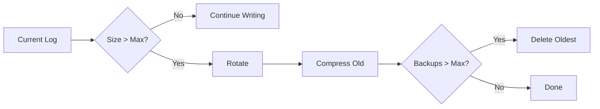
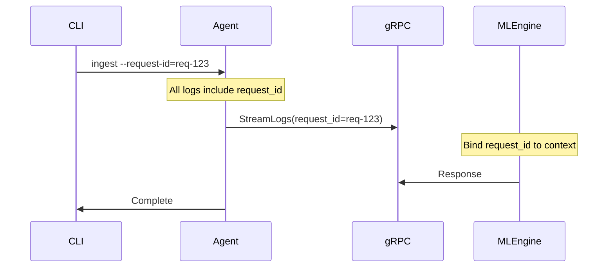

# Logging and Observability

## Overview

Sentinel Log AI uses structured JSONL (JSON Lines) logging optimized for:
- AWS Athena analysis
- Log aggregation systems (ELK, Splunk, Loki)
- Correlation across services
- Performance debugging

## Log Format

### JSONL Structure

Each log entry is a single-line JSON object:

```json
{"timestamp":"2024-01-15T10:30:00.000Z","level":"info","service":"sentinel-agent","hostname":"prod-01","pid":12345,"msg":"ingestion_started","path":"/var/log/app.log"}
```

### Standard Fields

| Field | Type | Description |
|-------|------|-------------|
| `timestamp` | ISO8601 | UTC timestamp |
| `level` | string | Log level (debug, info, warn, error) |
| `service` | string | Service name |
| `hostname` | string | Host name |
| `pid` | int | Process ID |
| `msg` | string | Event name (snake_case) |
| `caller` | string | Source file:line |

### Common Additional Fields

| Field | Type | Used For |
|-------|------|----------|
| `request_id` | string | Request correlation |
| `path` | string | File paths |
| `count` | int | Counts/quantities |
| `duration` | duration | Operation timing |
| `error_code` | string | Error classification |
| `batch_size` | int | Batch operations |

## Configuration

### Go Agent

```go
import "sentinel-log-ai/internal/logging"

// Setup with custom config
cfg := &logging.Config{
    Level:         "info",      // debug, info, warn, error
    LogDir:        "logs",      // Directory for log files
    LogFile:       "agent.jsonl", // Log filename
    MaxSizeMB:     10,          // Max size before rotation
    MaxBackups:    5,           // Number of backup files
    MaxAgeDays:    30,          // Max age in days
    EnableConsole: true,        // Log to stdout
    EnableFile:    true,        // Log to file
    ConsoleFormat: "plain",     // Console format (json, plain)
}

logging.Setup(cfg)
defer logging.Sync()
```

### Python ML Engine

```python
from sentinel_ml.logging import setup_logging, get_logger

# Setup with custom config
setup_logging(
    level="INFO",           # DEBUG, INFO, WARNING, ERROR
    format="json",          # json, plain
    log_dir="logs",         # Directory for log files
    log_file="ml.jsonl",    # Log filename
    max_bytes=10_000_000,   # Max size before rotation (10MB)
    backup_count=5,         # Number of backup files
    enable_console=True,    # Log to stdout
    enable_file=True,       # Log to file
)
```

## Usage Patterns

### Go Logging

```go
import (
    "sentinel-log-ai/internal/logging"
    "go.uber.org/zap"
)

func processLogs(path string) error {
    logger := logging.L()
    
    // Basic logging
    logger.Info("processing_started", logging.Path(path))
    
    // With additional fields
    logger.Info("batch_completed",
        logging.Path(path),
        logging.Count(100),
        logging.Duration(time.Second * 2),
    )
    
    // Context for request tracing
    reqLogger := logging.WithContext("req-123", "ingestion")
    reqLogger.Info("file_opened")
    reqLogger.Info("parsing_started")
    
    // Error logging
    if err != nil {
        logger.Error("processing_failed",
            logging.Path(path),
            logging.ErrorCode("SENTINEL_2003"),
            zap.Error(err),
        )
    }
    
    return nil
}
```

### Python Logging

```python
from sentinel_ml.logging import get_logger, bind_context, with_context

logger = get_logger(__name__)

def process_batch(records: list[LogRecord]) -> None:
    # Basic logging
    logger.info("processing_started", batch_size=len(records))
    
    # Bind context for all subsequent logs
    bind_context(request_id="req-123", operation="embedding")
    
    # With context manager
    with with_context(step="normalization"):
        logger.debug("normalizing_records")
        # Logs will include step="normalization"
    
    # Error logging
    try:
        embeddings = generate_embeddings(records)
    except Exception as e:
        logger.error(
            "embedding_failed",
            batch_size=len(records),
            error_code="SENTINEL_3001",
            exc_info=True,
        )
        raise
    
    logger.info("processing_completed", embedding_count=len(embeddings))
```

## Log Levels

### When to Use Each Level

| Level | Use Case | Example |
|-------|----------|---------|
| DEBUG | Detailed troubleshooting | `parsing_line`, `cache_hit` |
| INFO | Normal operations | `ingestion_started`, `batch_completed` |
| WARN | Potential issues | `high_memory_usage`, `slow_response` |
| ERROR | Failures | `processing_failed`, `connection_lost` |

### Production Recommendations

- **Production**: INFO level
- **Debugging**: DEBUG level
- **Quiet mode**: WARN level

## Rolling Logs

### Rotation Strategy



### File Naming

```
logs/
  sentinel-agent.jsonl          # Current log
  sentinel-agent.jsonl.1.gz     # Previous (compressed)
  sentinel-agent.jsonl.2.gz     # Older
  sentinel-agent.jsonl.3.gz     # Oldest
```

## AWS Athena Integration

### Table Creation

```sql
CREATE EXTERNAL TABLE sentinel_logs (
    `timestamp` STRING,
    level STRING,
    service STRING,
    hostname STRING,
    pid INT,
    msg STRING,
    caller STRING,
    request_id STRING,
    path STRING,
    count INT,
    duration STRING,
    error_code STRING,
    batch_size INT
)
ROW FORMAT SERDE 'org.openx.data.jsonserde.JsonSerDe'
LOCATION 's3://your-bucket/logs/'
TBLPROPERTIES ('has_encrypted_data'='false');
```

### Useful Queries

```sql
-- Error distribution by code
SELECT error_code, COUNT(*) as cnt
FROM sentinel_logs
WHERE level = 'error'
AND date = current_date
GROUP BY error_code
ORDER BY cnt DESC;

-- Slow operations
SELECT msg, AVG(CAST(REPLACE(duration, 's', '') AS DOUBLE)) as avg_duration
FROM sentinel_logs
WHERE duration IS NOT NULL
GROUP BY msg
HAVING AVG(CAST(REPLACE(duration, 's', '') AS DOUBLE)) > 1.0
ORDER BY avg_duration DESC;

-- Request flow tracking
SELECT timestamp, msg, path, count
FROM sentinel_logs
WHERE request_id = 'req-abc123'
ORDER BY timestamp;

-- Hourly ingestion volume
SELECT 
    DATE_TRUNC('hour', from_iso8601_timestamp(timestamp)) as hour,
    SUM(count) as total_logs
FROM sentinel_logs
WHERE msg = 'batch_completed'
GROUP BY 1
ORDER BY 1;
```

## Correlation and Tracing

### Request ID Pattern



### Cross-Service Correlation

```go
// Go Agent
logger := logging.WithContext(requestID, "ingestion")
logger.Info("starting_stream")

// gRPC metadata
md := metadata.Pairs("x-request-id", requestID)
ctx := metadata.NewOutgoingContext(ctx, md)
client.StreamLogs(ctx, req)
```

```python
# Python ML Engine
from grpc import ServicerContext

def StreamLogs(self, request_iterator, context: ServicerContext):
    metadata = dict(context.invocation_metadata())
    request_id = metadata.get("x-request-id", str(uuid4()))
    
    bind_context(request_id=request_id)
    logger.info("stream_started")
```

## Performance Considerations

### Async Logging

Both Go (zap) and Python (structlog) use async logging by default:

- Logs are buffered before writing
- File I/O doesn't block the main thread
- Call `Sync()` / `sync()` before shutdown

### Log Sampling

For high-volume debug logs:

```python
import random

if random.random() < 0.01:  # 1% sampling
    logger.debug("detailed_operation", ...)
```

### Structured vs Formatted

Always use structured logging:

```python
# Good: Structured
logger.info("request_processed", duration=0.5, status=200)

# Bad: Formatted string
logger.info(f"Request processed in {duration}s with status {status}")
```
